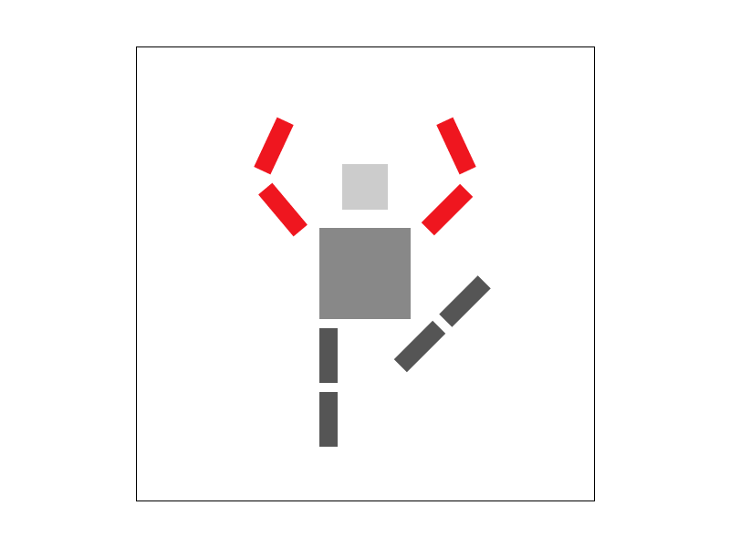

[Link to (this) Webpage](https://cal-cs184-student.github.io/sp22-project-webpages-asdegoyeneche/proj1/index.html)

[Link to Code](https://github.com/cal-cs184-student/p1-rasterizer-sp22-mr_graphics)

# Project 1 - Rasterizer

In this project, we implemented rasterization techniques, including drawing triangles, supersampling, transforms, interpolation with Barycentric coordinates, and texture mapping with antialiasing (pixel and level sampling). With this, we obtained a functional vector graphics rendered for simplified SVG files.

From a high-level perspective, the pipeline includes an `SVGParser` that reads the SVG files, an OpenGL `Viewer` that renders the images and tracks keyboard and mouse inputs, and a `DrawRend` class with methods to coordinate the drawing of `SVGElement` objects. These last objects would call the appropriate methods of a `Rasterizer` class, where most of the coding of this project focused on. 

## Task 1: Drawing Single-Color Triangles (20 pts)

### Answers

To rasterize triangles, we pick the bounding box containing the triangle in pixel coordinates. This is done by picking the minimum and maximum x and y coordinates for its three vertices and then taking the floor and ceil integers, respectively, to get our pixel boundaries.

After this, for each pixel in this bounding box (double for loop), we check if the pixel is contained in the triangle. Here, we use the center coordinates of the pixel (x + 0.5, y + 0.5) and check if it satisfies the three-line point-in-triangle test:


Our code overview looks like this:
```
    for (int x = (int) floor(min(x0, min(x1, x2))); x <= (int) ceil(max(x0, max(x1, x2))); ++x) {
      for (int y = (int) floor(min(y0, min(y1, y2))); y <= (int) ceil(max(y0, max(y1, y2))); ++y) {
        if (line_equation_test(x + 0.5, y + 0.5, x0, x1, y0, y1) &&
            line_equation_test(x + 0.5, y + 0.5, x1, x2, y1, y2) &&
            line_equation_test(x + 0.5, y + 0.5, x2, x0, y2, y0)) {
          fill_pixel(x, y, color);
        }
      }
    }
```

Alternatively, we could have computed barycentric coordinates and checked that alpha, beta, and gamma are all greater than 0, as done for Task 4.

Our algorithm is no worse than one that checks each sample in the bounding box, as that is exactly what we are doing. As it can be seen in the double for loop in the code above, we are going over each column and row in the bounding box only, and not sampling anything outside this region. Therefore, our time complexity here is O(H*W) of the triangle (i.e., two times its area), but with rounding up on the height and width. 

### Results

Here we can find a screenshot of our `basic/test4.png` example, with the corner of the green triangle highlighted:


## Task 2: Antialiasing by Supersampling (20 pts)

### Answers

To implement our supersampling algorithm, we used an intermediate buffer `sample_buffer` to store our high-resolution sampling image. This data structure is almost the same as our framebuffer, but larger. In particular, its size is `sample_rate` times bigger than the framebuffer vector. The `sample_buffer` structure corresponds to a flat `vector<Color>`, but for our purpose we imagine it as having a shape of (H, W, S), with H, W, and S being the framebuffer height, framebuffer width, and `sample_rate`, respectively. Alternatively, we could have thought of it as having shape (H, W, sqrt_S, sqrt_S) or (H * sqrt_S, W * sqrt_S) (i.e., a bigger grid).

The algorithm is similar to Task 1, but instead of just sampling the center of the pixel, we do more samples per pixel. The locations of these samples were evenly distributed such that they are equidistant in the horizontal and vertical dimensions. Again here, for each sample, we check if it is inside the triangle with the Three Line Test, and if so, we store the color in the `sample_buffer`. The following figure illustrates the idea (figure borrowed from project specs):


The code here looks as follows:

```
    int sqrt_rate = (int) sqrt(sample_rate);
    float delta = 1.0f / sqrt(sample_rate);

    for (int x = (int) floor(min(x0, min(x1, x2))); x <= (int) ceil(max(x0, max(x1, x2))); ++x) {
      for (int y = (int) floor(min(y0, min(y1, y2))); y <= (int) ceil(max(y0, max(y1, y2))); ++y) {
        for (int i = 0; i < sqrt_rate; ++i) {
          for (int j = 0; j < sqrt_rate; ++j) {
            if (line_equation_test(x + (0.5 + i) * delta, y + (0.5 + j) * delta, x0, x1, y0, y1) &&
                line_equation_test(x + (0.5 + i) * delta, y + (0.5 + j) * delta, x1, x2, y1, y2) &&
                line_equation_test(x + (0.5 + i) * delta, y + (0.5 + j) * delta, x2, x0, y2, y0)) {

              sample_buffer[(y * width + x) * sample_rate + j * sqrt_rate + i] = color;
            }
          }
        }
      }
    }
```

Finally, once we rasterize all triangles into the `sample_buffer`, we have to resolve the `sample_buffer` to the `framebuffer`. This step can be thought of as an average pooling operation with kernel size `sample_rate` and stride `sample_rate` on a high-resolution image; however, given our data structure format, we process it a bit differently: basically, for each pixel position, we compute the average color value for all samples in the pixel. In other words, we go from our data that we think of shape (H, W, S) to (H, W) by reducing mean in the last dimension. The code for this looks as follows:

```
    float color_value;
    for (int x = 0; x < width; ++x) {
      for (int y = 0; y < height; ++y) {
        for (int k = 0; k < 3; ++k) {

          color_value = 0;
          for (int i = 0; i < sample_rate; ++i) {
            Color col = sample_buffer[(y * width + x) * sample_rate + i];
            color_value += (&col.r)[k];
          }

          this->rgb_framebuffer_target[3 * (y * width + x) + k] = int(color_value / sample_rate * 255);
        }
      }
    }
  }
```

The other modifications to the pipeline included:
- Update `fill_pixel` method to include the sample rate and fill all samples in the pixel.
- Update `set_sample_rate` method to resize the `sample_buffer` to `H*W*S` when the sample rate is modified:
```
  void RasterizerImp::set_sample_rate(unsigned int rate) {
    this->sample_rate = rate;
    this->sample_buffer.resize(width * height * rate, Color::White);
  }
```
- Update `set_framebuffer_target` to update the `sample_buffer` size to `H*W*S` when the framebuffer dimensions are changed. Code is similar to `set_sample_rate`.

Why is supersampling useful? Supersampling is useful to avoid aliasing when we sample. Supersampling helps to get rid of jaggies and discontinuities produced by sampling below the Nyquist frequency. The idea is to increase the sampling frequency and the average down, getting rid of high frequencies and therefore only obtaining signals with lower frequencies that better respect the Nyquist criteria. We can interpret supersampling as an approximate low pass filter before sampling for antialiasing. 

In triangles, this is particularly useful in edges and vertices. Here, we get jaggies and discontinuities due to aliasing, which can be compensated with supersampling. This is especially notorious in lower resolution cases and corners, where some pixels are left out by just a little bit (or added by just a little bit), where we obtain figures that don't resemble the original triangle too well (jaggies). This can be clearly seen in the results below, where the sharp vertex has discontinuities if we don't supersample enough. 


### Results

Sampling rate 1            |  Sampling rate 4         |  Sampling rate 16        
:-------------------------:|:-------------------------:|:-------------------------:
   |   |  


We have included the images not side-by-side as well below so more details can be appreciated:

1. Sampling rate 1.


1. Sampling rate 4.


1. Sampling rate 16.


## Task 3: Transforms (10 pts)

We made our cubeman do some dance position! We have also updated its coloring to look closer to a Baxter Robot (+ legs). To achieve this, we played with the position and orientation of its components, as well as changed the colors.



[Link to svg format](docs/my_robot.svg)


## Task 4: Barycentric coordinates (10 pts)

### Answers

From our understanding, the barycentric coordinates of a certain point can be represented as a linear combination of reference points (a triangle for points in a plane).
More specifically, as shown in the figure below, suppose we have some specified values (e.g., texture, coordinates) at the vertices of a triangle: `(x_A,y_A);(x_B,y_B);(x_C,y_C)`. Then, the value of any point on the plane `(x,y)` can be written as a linear combination of the values at vertices.


Another example shows the Barycentric coordinates linearly interpolate colors at vertices (Figure borrowed from lecture slides):


### Results:

Interpolated color wheel:


## Task 5: "Pixel sampling" for texture mapping (15 pts)

### Answers

From our understanding, pixel-sampling means that we sample the texture map at its original resolution, instead of sampling at down-sampled Mipmaps (Level sampling). For each rasterized screen sample `(x,y)`, we evaluate the corresponding texcoord value `(u,v)` and sample it at the texture map.
Since texcoord `(u,v)` does not have to be integer, 
`nearest sampling` samples the texture value at the discretized coordinates nearest to `(u,v)`.

Our code:
```asm
  Color Texture::sample_nearest(Vector2D uv, int level) {
    auto &mip = mipmap[level];
    int tx = (int) round(uv.x * (float) mip.width);
    int ty = (int) round(uv.y * (float) mip.height);

    // If we are in extremes just pick the edge pixel (instead of returning invalid pixel magenta.
    tx = max(0, min(tx, (int) mip.width) - 1);
    ty = max(0, min(ty, (int) mip.height) - 1);

    return mip.get_texel(tx, ty);
  }
```
`bilinear sampling` interpolates the texture values at four discretized coordinates nearest to `(u,v)` by the corresponding distances.

Our code:
```asm
Color Texture::sample_bilinear(Vector2D uv, int level) {
    auto &mip = mipmap[level];

    float uv_x = (float) uv.x * (float) mip.width;  // in-between float pixel coordinates
    float uv_y = (float) uv.y * (float) mip.height;

    float x0 = floor(uv_x);  // rounded float pixel coordinates
    float y0 = floor(uv_y);
    float x1 = ceil(uv_x);
    float y1 = ceil(uv_y);
    // Other two points are (x0, y1) and (x1, y0)

    float dx = (uv_x - x0) / (x1 - x0);  // relative distance from x0 (from left). Can get rid of normalization, it's
    float dy = (uv_y - y0) / (y1 - y0);  // relative distance from y0 (from top).   already one pixel.

    int tx0 = (int) x0;  // int pixel coordinates
    int ty0 = (int) y0;
    int tx1 = (int) x1;
    int ty1 = (int) y1;

    Color c_y0 = (1 - dx) * mip.get_texel(tx0, ty0) + dx * mip.get_texel(tx1, ty0);  // top interpolate
    Color c_y1 = (1 - dx) * mip.get_texel(tx0, ty1) + dx * mip.get_texel(tx1, ty1);  // bottom interp
    Color c = (1 - dy) * c_y0 + dy * c_y1;  // interpolate top and bottom

    return c;
  }
```

### Results

Nearest sampling at 1 sample per pixel:

Bilinear sampling at 1 sample per pixel:

Nearest sampling at 16 sample per pixel:

Bilinear sampling at 16 sample per pixel:


**Analysis:**
Aliasing happens when the textures are of high frequency (with sharper textures), and the sampling rate is relatively low. 
We observe aliasing at those vertical lines when we use nearest sampling at 1 sample per-pixel. 
Increasing the sampling rate (Supersampling - `Nearest sampling at 16 samples per pixel`) can help de-alias the image.
On the other hand, bilinear sampling (`Bilinear sampling at 1 sample per pixel`) works as a low-pass filter on the texture map, which can effectively reduce the aliasing at those high-frequency regions without increasing the sampling rate. However, bilinear sampling can induce some blurring effect due to the reduced frequency of the feature map. 
For the regions where the textures are smooth and have relatively low frequency, the difference between approaches is less obvious.

## Task 6: "Level sampling" with mipmaps for texture mapping (25 pts)

### Answers

1. From our understanding, level sampling is an efficient strategy to reduce the aliasing in the high-frequency region by pre-filtering the texture images. Alternatively, we can do supersampling, which is much more computationally expensive.
Level sampling uses mipmaps, which are smaller, pre-filtered versions of a texture image. Therefore, we can effectively reduce the aliasing by reducing the spatial frequency of the texture images. However, level sampling can induce a blurring effect to the rasterized image.
Practically, we determine the mipmap level by evaluating the derivative of the texture coordinates w.r.t. the screen coordinates, then we sample the textures at a different resolution to rasterize alias-free images.
2. Compared to pixel-sampling, level sampling requires storing multiple mipmaps (increased memory usage). On the other hand, level sampling requires evaluating the derivative of the texture coordinates, which will slightly lower the speed down. This approach can effectively de-alias the image. Supersampling can also de-alias the rasterized image, but requires much more rasterization time (evaluating 4x points for 4x supersampling) as well as memory usage to store the subpixel values temporarily. It's difficult to compare the antialiasing power between level sampling and supersampling, depending on the textures and locations.

### Results
Here, we visualize an image of the cutest cat on the earth: June. We use the pixel inspector to show the difference in the region of high-frequency components (eyebrows).
1. `L_ZERO + P_NEAREST`

2. `L_ZERO + P_LINEAR`

3. `L_NEAREST + P_NEAREST`

4. `L_NEAREST + P_NEAREST`


## Extra credit

We created an approximate version of the [Shepp Logan Phantom](https://en.wikipedia.org/wiki/Shepp%E2%80%93Logan_phantom). This phantom serves as a simplified model for a human brain and is widely used to test image reconstruction algorithms in the field of medical imaging. 

In order to create the figure, we need to create ellipses. However, we do not have ellipses nor circles implemented in our SVG parser and rasterization. Therefore, we created our own unit circle polygon coordinates with 100 points using Python, and used this circle as our base shape to create the phantom. For each ellipse in the figure, we added scaling, rotation and translation, and use the respective color. In the pipeline, each circle polygon is converted to triangles that we then rasterize. 

The python code is super simple, consists of the following:

```
    num_points = 100
    angles = np.linspace(0, 2 * np.pi, num_points)
    x, y = np.cos(angles), np.sin(angles)

    points_string = " ".join(f"{_x:.5f}, {_y:.5f}" for (_x, _y) in zip(x, y))
    print(f'<polygon points="{points_string}" />')
```

We then copied/pasted this unit circle polygon and used it for every ellipse we drew in the SVG file. We tried creating a definition of the unit circle once to then reuse it, but it seems that we don't have the `<defs>` and `<use>` commands implemented in the parser. Clearly, the number of points in the circle is a parameter that can be increased, but we saw decent results with 100 points.


[Link to svg format](docs/competition.svg)

## Webpage and Code links:

[Link to (this) Webpage](https://cal-cs184-student.github.io/sp22-project-webpages-asdegoyeneche/proj1/index.html): https://cal-cs184-student.github.io/sp22-project-webpages-asdegoyeneche/proj1/index.html

[Link to Code](https://github.com/cal-cs184-student/p1-rasterizer-sp22-mr_graphics): https://github.com/cal-cs184-student/p1-rasterizer-sp22-mr_graphics
