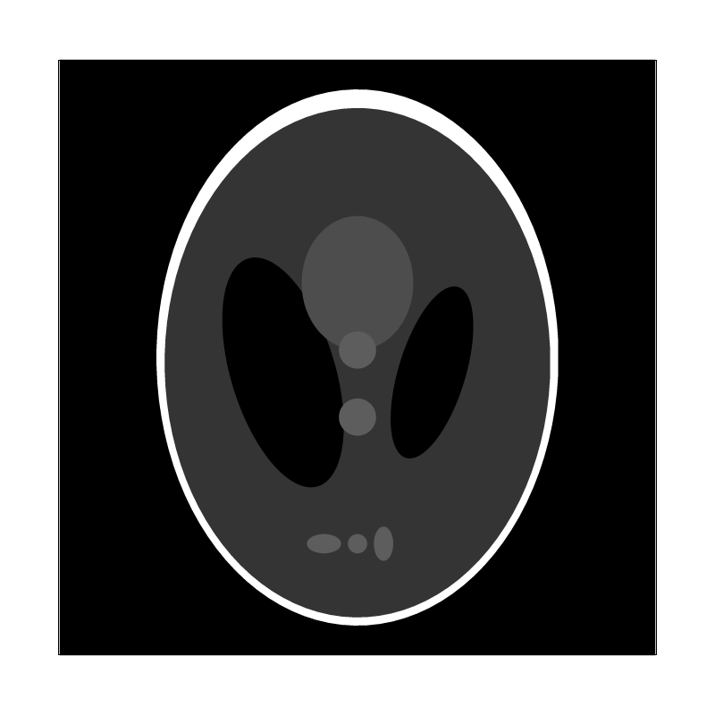

[Link to (this) Webpage](https://cal-cs184-student.github.io/sp22-project-webpages-asdegoyeneche/proj1/index.html)

[Link to Code](https://github.com/cal-cs184-student/p1-rasterizer-sp22-mr_graphics)


# Project 1 - Rasterizer


TODO: An overview of the project, your approach to and implementation for each of the parts, and what problems you encountered and how you solved them. Strive for clarity and succinctness.


## Task 1: Drawing Single-Color Triangles (20 pts)

### Answers

In order to rasterize triangles, we start by picking the bounding box that contains the triangle in pixel coordinates. This is done by picking the minimum and maximum x and y coordinates for its three vertices, and then taking the floor and ceil integers, respectively, to get our pixel boundaries.

After this, for each pixel in this bounding box (double for loop), we check if the pixel is contained in the triangle. Here, we use the center coordinates of the pxiel (x + 0.5, y + 0.5) and check if it satisfies the three line point-in-triangle test:


Our code overview looks like:
```
    for (int x = (int) floor(min(x0, min(x1, x2))); x <= (int) ceil(max(x0, max(x1, x2))); ++x) {
      for (int y = (int) floor(min(y0, min(y1, y2))); y <= (int) ceil(max(y0, max(y1, y2))); ++y) {
        if (line_equation_test(x + 0.5, y + 0.5, x0, x1, y0, y1) &&
            line_equation_test(x + 0.5, y + 0.5, x1, x2, y1, y2) &&
            line_equation_test(x + 0.5, y + 0.5, x2, x0, y2, y0)) {
          fill_pixel(x, y, color);
        }
      }
    }
```

Alternatively, we could have computed barycentric coordinates and check that alpha, beta, and gamma are all greater than 0, as done for Task 4.


We have that our algorithm is no worse than one that checks each sample in the bouding box as that is exactly what we are doing. As it can be seen in the double foor loop in the code above, we are going over each column and row in the bounding box only, and not sampling anything outside this region. Therefore, we our time complexity here is O(H*W) of the triangle (i.e. two times its area), but with rounding up on the height and width. 


### Results

Here we can find a screenshot of our `basic/test4.png` example, with the corner of the green triangle highlighted:


## Task 2: Antialiasing by Supersampling (20 pts)


### Answers


### Results


Sampling rate 1            |  Sampling rate 4         |  Sampling rate 16        
:-------------------------:|:-------------------------:|:-------------------------:
   |   |  


We have included the images not side-by-side as well below so more details can be appreciated:

1. Sampling rate 1.


1. Sampling rate 4.


1. Sampling rate 16.


## Task 3: Transforms (10 pts)


We made our cubeman do some dance position! We have also updated its colouring to look closer to a Baxter Robot (+ legs).


[Link to svg format](docs/my_robot.svg)


## Task 4: Barycentric coordinates (10 pts)

### Answers

From our understanding, the barycentric coordinates of a certain point can be represented as a linear combination of reference points (a triangle for points in a plane).
More specifically, as shown in the figure below, suppose we have some specified values (e.g., texture, coordinates) at the vertices of a triangle: `(x_A,y_A);(x_B,y_B);(x_C,y_C)`. Then, the value of any point on the plane `(x,y)` can be written as a linear combination of the values at vertices.


Another example shows the Barycentric coords linearly interpolate colors at vertices (Figure borrowed from lecture slides):


### Results:

Interpolated color wheel:


## Task 5: "Pixel sampling" for texture mapping (15 pts)

### Answers

From our understanding, pixel-sampling means that we sample the texture map at its original resolution, instead of sampling at down-sampled Mipmaps (Level sampling). For each rasterized screen sample `(x,y)`, we evaluate the corresponding texcoord value `(u,v)` and sample it at the texture map.
Since texcoord `(u,v)` does not have to be integer, 
`nearest sampling` samples the texture value at the discretized coordinates nearest to `(u,v)`.

Our code:
```asm
  Color Texture::sample_nearest(Vector2D uv, int level) {
    auto &mip = mipmap[level];
    int tx = (int) round(uv.x * (float) mip.width);
    int ty = (int) round(uv.y * (float) mip.height);

    // If we are in extremes just pick the edge pixel (instead of returning invalid pixel magenta.
    tx = max(0, min(tx, (int) mip.width) - 1);
    ty = max(0, min(ty, (int) mip.height) - 1);

    return mip.get_texel(tx, ty);
  }
```
`bilinear sampling` interpolates the texture values at four discretized coordinates nearest to `(u,v)` by the corresponding distances.

Our code:
```asm
Color Texture::sample_bilinear(Vector2D uv, int level) {
    auto &mip = mipmap[level];

    float uv_x = (float) uv.x * (float) mip.width;  // in-between float pixel coordinates
    float uv_y = (float) uv.y * (float) mip.height;

    float x0 = floor(uv_x);  // rounded float pixel coordinates
    float y0 = floor(uv_y);
    float x1 = ceil(uv_x);
    float y1 = ceil(uv_y);
    // Other two points are (x0, y1) and (x1, y0)

    float dx = (uv_x - x0) / (x1 - x0);  // relative distance from x0 (from left). Can get rid of normalization, it's
    float dy = (uv_y - y0) / (y1 - y0);  // relative distance from y0 (from top).   already one pixel.

    int tx0 = (int) x0;  // int pixel coordinates
    int ty0 = (int) y0;
    int tx1 = (int) x1;
    int ty1 = (int) y1;

    Color c_y0 = (1 - dx) * mip.get_texel(tx0, ty0) + dx * mip.get_texel(tx1, ty0);  // top interpolate
    Color c_y1 = (1 - dx) * mip.get_texel(tx0, ty1) + dx * mip.get_texel(tx1, ty1);  // bottom interp
    Color c = (1 - dy) * c_y0 + dy * c_y1;  // interpolate top and bottom

    return c;
  }
```

### Results

Nearest sampling at 1 sample per pixel:

Bilinear sampling at 1 sample per pixel:

Nearest sampling at 16 sample per pixel:

Bilinear sampling at 16 sample per pixel:


**Analysis:**
Aliasing happens when the textures are of high-frequency (with sharper textures) and the sampling rate are relative low. 
We observe aliasing at those verticle lines when we use nearest sampling at 1 sample per-pixel. 
Increasing the sampling rate (Super sampling - `Nearest sampling at 16 sample per pixel`) can help de-aliase the image.
On the other hand, binearly sampling (`Bilinear sampling at 1 sample per pixel`) works as a low-pass filter on the texture map, which can effectively reduce the aliasing at those high-frequency regions without modifying the sampling rate. However, bilinear sampling can induce some blurring effect due to the reduced frequency of the feature map. 
For the regions where the textures are smooth and have relative low frequency, difference between approaches are less obvious.

## Task 6: "Level sampling" with mipmaps for texture mapping (25 pts)

### Answers

1. From our understanding, level sampling is an efficient strategy to reduce the aliasing in the high-frequency region by pre-filtering the texture images. Alternatively, we can do super-sampling, which is much more computational expensive.
Level sampling uses mipmaps, which are smaller, pre-filtered versions of a texture image. Therefore, we can effectively reduce the aliasing by reducing the spatial frequency of the texture images. However, level sampling can induce blurring effect to the rasterized image.
Practically, we determine the mipmap level by evaluating the derivative of the texture coordinate w.r.t. the screen coordinate, then we sample the textures at different resolution to rasterize alias-free images.
2. Compared to pixel-sampling, level sampling requires storing multiple mipmaps (increased memory usage). On the other hand, level sampling requires evaluating the derivative of the texture coordinates, which will slightly lower down the speed. This approach can effectively de-aliase the image. Supersampling can also de-aliase the rasterzied image, but requires much more rasterization time (evaluating 4x points for 4x super sampling) as well as memory usage to temporarily store the subpixel values. It's difficult to compare the anti-aliasing power between level sampling and super sampling, depends on the textures and locations.

### Results
Here, we visualize an image of the cutest cat on the earth: June. We use the pixel inspector to show the difference in the region of high-frequency components (eyebrows).
1. `L_ZERO + P_NEAREST`

2. `L_ZERO + P_LINEAR`

3. `L_NEAREST + P_NEAREST`

4. `L_NEAREST + P_NEAREST`


## Extra credit



[Link to svg format](docs/competition.svg)


## Webpage and Code links:

[Link to (this) Webpage](https://cal-cs184-student.github.io/sp22-project-webpages-asdegoyeneche/proj1/index.html): https://cal-cs184-student.github.io/sp22-project-webpages-asdegoyeneche/proj1/index.html

[Link to Code](https://github.com/cal-cs184-student/p1-rasterizer-sp22-mr_graphics): https://github.com/cal-cs184-student/p1-rasterizer-sp22-mr_graphics
