[Link to (this) Webpage](https://cal-cs184-student.github.io/sp22-project-webpages-asdegoyeneche/proj2/index.html)

[Link to Code](https://github.com/cal-cs184-student/p2-meshedit-sp22-mr_graphics_2)


# Project 2 - MeshEdit

#### Overview

In this project, we work on topics on geometric modeling. We first explore the implementation of Bezier Curves and their extension to Surfaces by implementing De Casteljau's recursive algorithm. We also dive into triangle mesh manipulation with the half-edge data structure. Here, we get a feel of the effectiveness of the data structure by implementing area-weighted vertex normals, edge flips, and edge splits. Finally, we also use the data structure for doing loop subdivision for upsampling meshes.


## Section I: Bezier Curves and Surfaces

### Part 1: Bezier Curves with 1D de Casteljau Subdivision (10 pts)

#### Answers

De Casteljau's algorithm is a recursive method to obtain points on the Bezier curve. On each recursive step we start with N control points (p_1, ..., p_n), and we obtain (N-1) intermediate control points given a parameter `t` (in 0-1 range) in the next subdivision level (p'_1, ..., p'_{n-1}). We apply this recursively until we reach a final single point that lies on the Bezier curve for the given `t` value. At each method call, we find the intermediate control points by interpolating the original control points using the parameter t:

`p'_i = lerp(p_i, p_{i+1}, t) = (1-t)*p_i + t*p_{i+1}`.

With this, at each level of evaluation we will obtain the new points in positions between the previous level points, converging to a single point at the end. Then, if we modify the `t` parameter from 0 to 1 we will be able to traverse over the Bezier curve from start to end. While doing this, every intermediate point is also adjusting its relative position with respect to its 'parent' points proportionally to `t`.

Our implementation follows the described algorithm, where we wrote the method used on each recursive call. This methods takes N points and return N-1 intermediate points:

```
  std::vector<Vector2D> BezierCurve::evaluateStep(std::vector<Vector2D> const &points) {

    // I compared (timed) approaches initialize with size vs push_back, and initializing is about twice as fast.
    std::vector<Vector2D> output = std::vector<Vector2D>(points.size() - 1);
    for (int i = 0; i < points.size() - 1; ++i) {
      output[i] = points[i] * (1 - t) + points[i + 1] * t;
    }
    return output;
  }
```

This method is called recursively on the obtained points until we reach a single point that is returned. We explain more about the outer loop implementation in Part 2, which was implemented by us in that part.

#### Results

Step 0           |  Step 1       
:-------------------------:|:-------------------------:
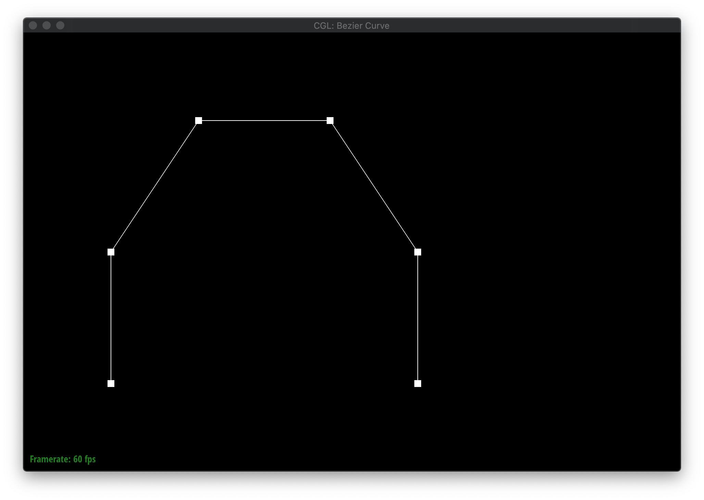   |  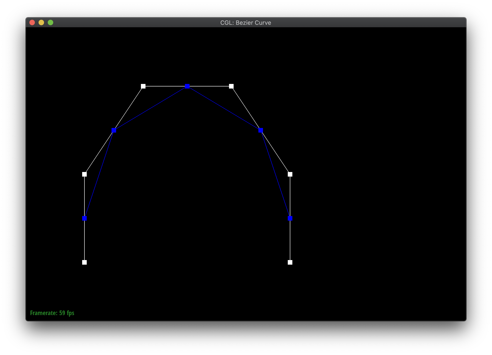 |  
Step 2          | Step 3          
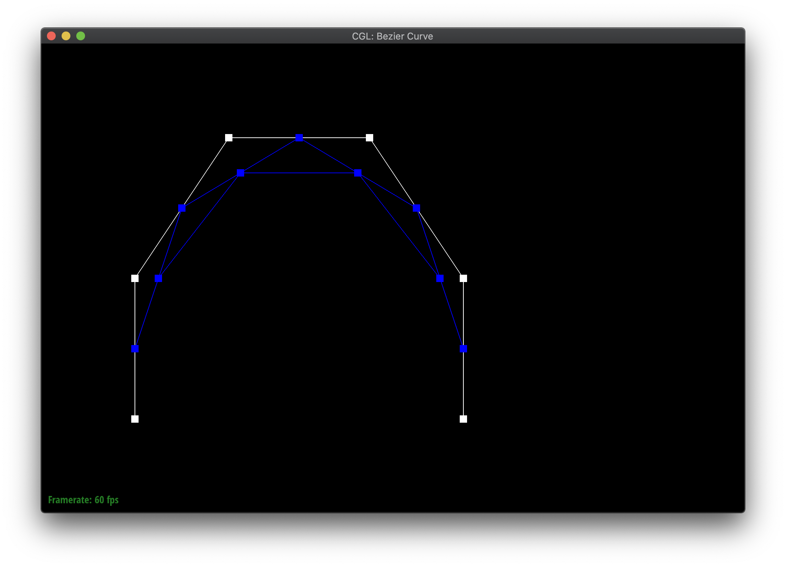 | 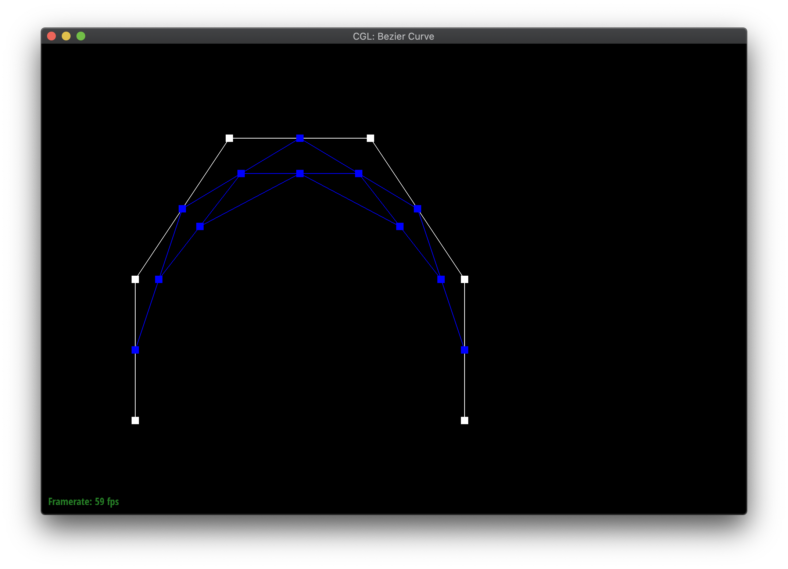  
 Step 4         |   Step 5
  |  
 Bezier curve         | 
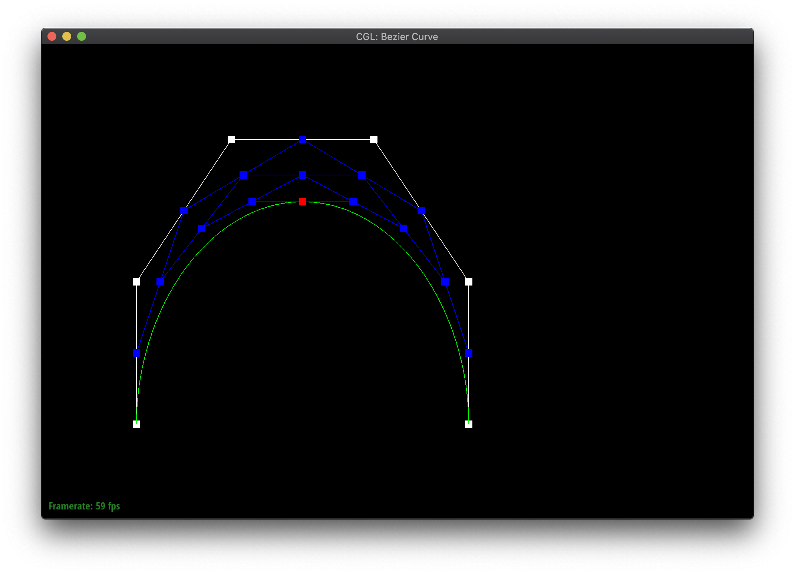   | 
  Move Control Points        |   Change `t` parameter
 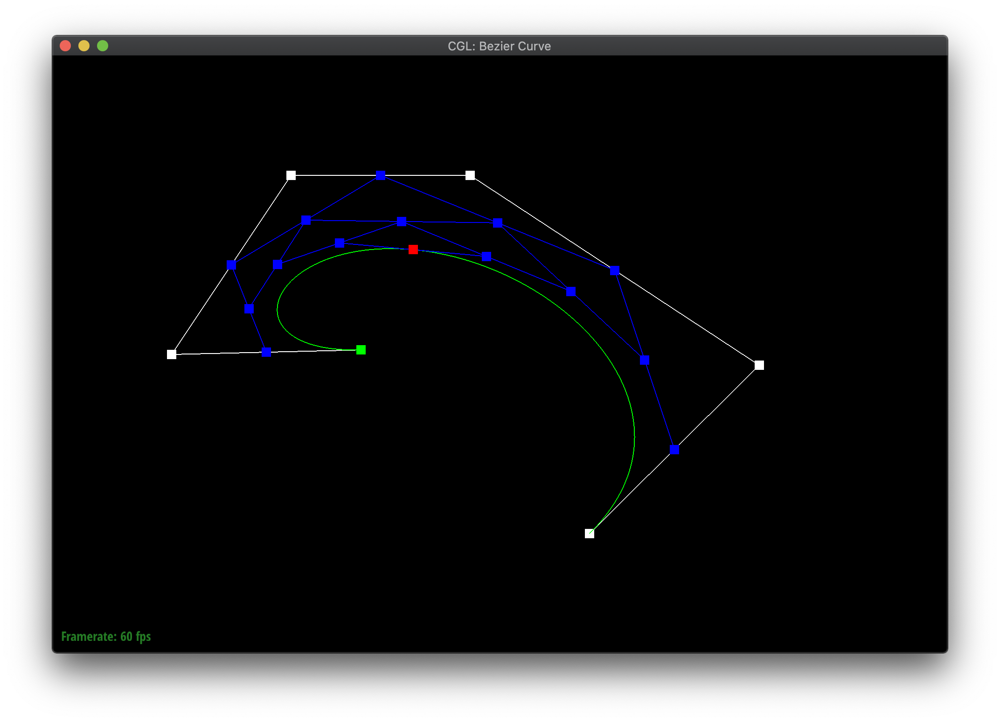 |  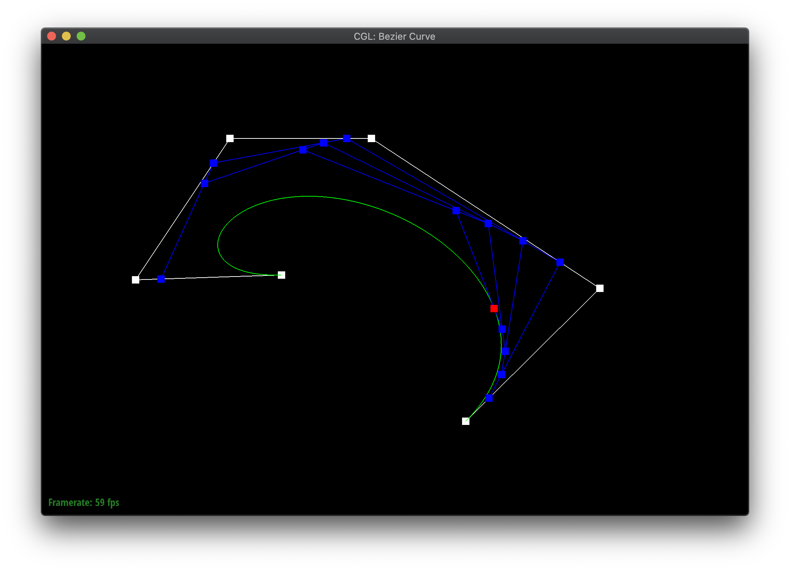


### Part 2: Bezier Surfaces with Separable 1D de Casteljau (15 pts)

#### Answer

To extend De Casteljau's algorithm to surfaces we just need to apply the 1D algorithm for each dimension of our surface (separable 1D de Casteljau algorithm). In this case, we have two parameters `u`, `v` that control our position in the Bezier surface.
Given an NxN grid of control points, we first define a bezier curve parametrized by `u` for each row in our grid. Obtaining this curve follows the same recursive step as in Part 1, and we do the recursive step until we obtain a single point `P_i` on the Bezier curve for each row. Then, we pick the obtained `P_i`s from each row and define a new Bezier curve with these points. This new curve is parametrized by `v` and we run the same recursive step until we reach our final single point `P` that lies on the Bezier surface!

Our implementation for this part adds the calls to the recursive function. The recursive step is the same as in Part 1, but with slight changes for datatypes:
```
  std::vector<Vector3D> BezierPatch::evaluateStep(std::vector<Vector3D> const &points, double t) const {
    std::vector<Vector3D> output = std::vector<Vector3D>(points.size() - 1);
    for (int i = 0; i < points.size() - 1; ++i) {
      output[i] = points[i] * (1 - t) + points[i + 1] * t;
    }
    return output;
  }
```

Then, we also had to implement the function to make the calls to our `evaluateStep` function. This function will run the recursive step until we reach our final point: 

```
  Vector3D BezierPatch::evaluate1D(std::vector<Vector3D> const &points, double t) const {
    std::vector<Vector3D> _points = points;
    for (int i = 0; i < points.size(); ++i) {
      _points = BezierPatch::evaluateStep(_points, t);
    }
    return _points[0];  // points is of len 1 by now, we just retrieve the single final point.
  }
```

Finally, we have the function that calls `evaluate1D` for each row in our grid, and later calls the function on the points obtained from each row. With this, we obtain our final point in the Bezier surface. Note that here we again can control where on the surface we want to be with the parameters `u` and `v`.

```
  Vector3D BezierPatch::evaluate(double u, double v) const {
    std::vector<Vector3D> controlCurve = std::vector<Vector3D>(controlPoints.size());
    for (int i = 0; i < controlPoints.size(); ++i) {
      controlCurve[i] = evaluate1D(controlPoints[i], u);
    }
    return evaluate1D(controlCurve, v);
  }
```

#### Results


Teapot.bez with wireframe       |  Teapot.bez no wireframe        
:-------------------------:|:-------------------------:
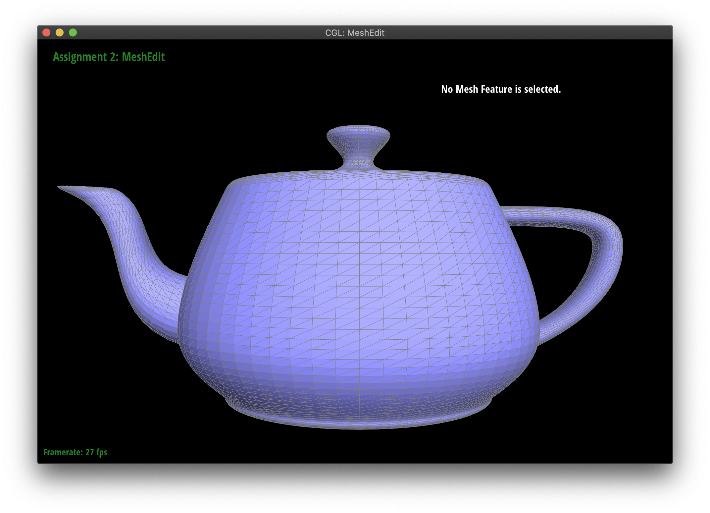   |  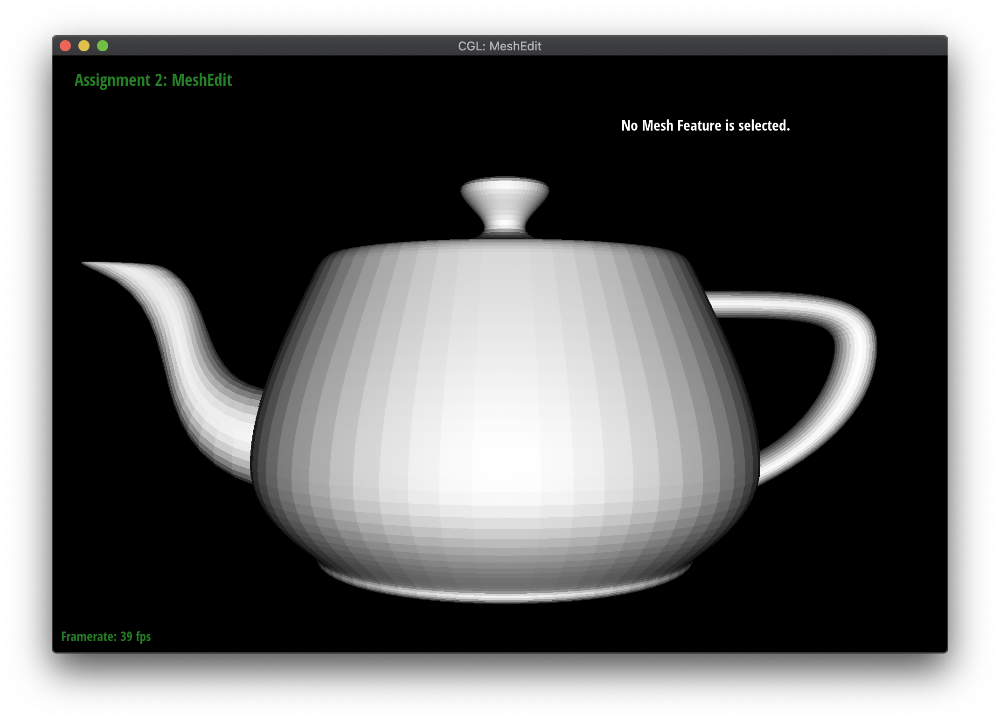 


## Section II: Triangle Meshes and Half-Edge Data Structure


### Part 3: Area-Weighted Vertex Normals (10 pts)

#### Answers

To implement the area-weighted vertex normals we iterated through the faces that the vertex belongs to. To do so, we first start from a halfedge associated with the vertex and check if the associated face is a boundary or not. If the face is not a boundary, we obtain the other vertices associated with this face and compute the area (0.5 times the norm of the cross product of edge vectors starting from the vertex of interest). Once we get the area, we add the face normal vector weighted by its area to a accumulator `mean_normal`.
 Then, we go to the next face, to do so, we go to the current half edge twin, and then to the next halfedge, arriving to a halfedge in the next face. We do this until we reach back to our starting halfedge. Finally, once we accumulated the weighted normals for all faces, we normalize our final vector `mean_normal` to be of unit length and we return it!


```
  Vector3D Vertex::normal(void) const {

    Vector3D mean_normal;
    HalfedgeCIter hedge = halfedge();

    do {
      if (!hedge->face()->isBoundary()) {
        auto area = 0.5 * cross(hedge->next()->vertex()->position - position,
                                hedge->next()->next()->vertex()->position - position).norm();
        mean_normal += area * hedge->face()->normal();
      }
      hedge = hedge->twin()->next();
    } while (hedge != halfedge());

    return mean_normal.unit();  // No need to normalize by total area if we normalize to unit vector
  }
```

Fortunately, this part didn't need too much debugging. We just needed to make sure we were traversing the faces properly, but some of the provided examples in the project resources were very helpful! Also, some thought had to go into making sure we were obtaining the right vertices to compute the faces areas, and that the area sign was correct.


#### Results

Without vertex normals         |   With vertex normals
:-------------------------:|:-------------------------:
 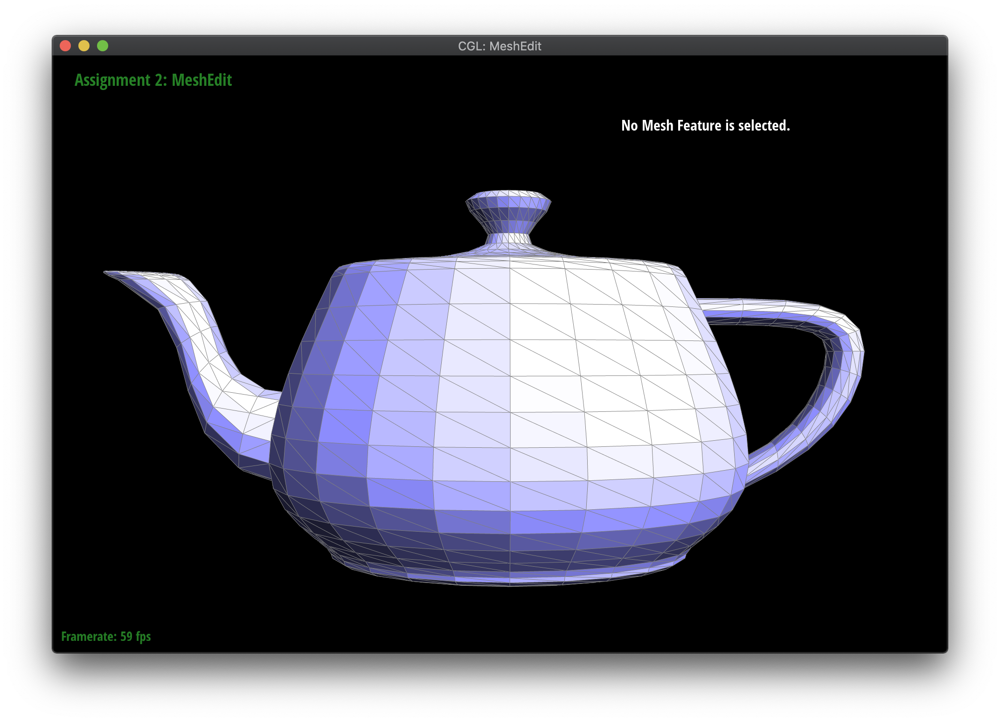 |  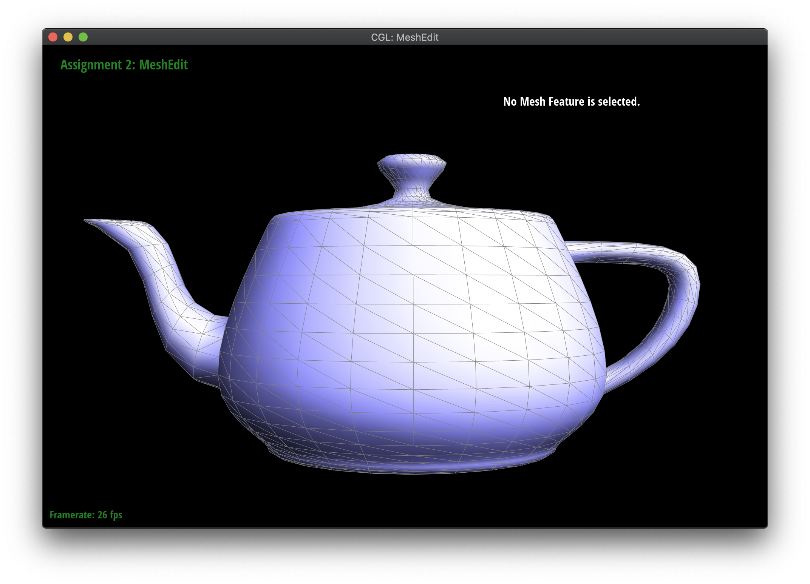
  |  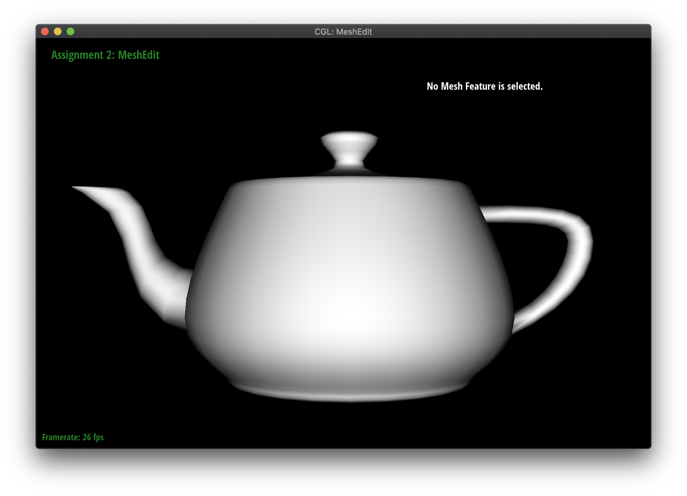


### Part 4: Edge Flip (15 pts)

#### Answers

To implement edge flip operation we needed to reassign pointers for halfedges, faces, and vertices. Many halfedges pointers can stay same, but to make sure we don't miss any we just reassined its next, twin, vertex, edge and face for each of them. To do this, we started with the simple example provided and clearly named every vertex, halfedge and face on the original setup, and then choose what face and halfedge will be which on the new setup. With this, we just need to write some lines to set pointers for each halfedge with `setNeighbors`. We also need to re-set the halfedge for some vertices and faces. That's all we needed to do, there was some extra assignments that did no need to be updated, but helped make sure everything worked properly. All these operations run in constant amount of work and do not add or delete any elements.
 
  We initially tried skipping some pointer assignments but missed some pointers which lead into hard-to-find bugs, so we went into assigning everything as explained. Something important was extracting halfedges, faces, and vertices pointers *before* doing any reassingment, otherwise these pointers would be lost or changed if we retrieve them later. Our code looks something like this:
  
  ```
    \\ First, retrieve pointers
    HalfedgeIter h0 = e0->halfedge();
    HalfedgeIter h3 = h0->twin();
    HalfedgeIter h1 = h0->next();
    \\ ... etc
    VertexIter v1 = h1->vertex();  // same as v3 initially
    VertexIter v2 = h2->vertex();
    \\ ... etc
    FaceIter f0 = h0->face();
    FaceIter f1 = h3->face();

    \\ Second, assign neighbors for each half-edge
    h0->setNeighbors(h2, h3, v5, e0, f0);  // Changes: vertex, next
    \\ ... etc
    
    \\ Assign halfedged for each vertex and face
    v1->halfedge() = h1;
    f0->halfedge() = h0;
    \\ ... etc
 ```

Note here that our numbering for each reassignment depends in our initial naming, so here we are not stressing the numbers of each halfedge, face and vertex, but want to show the steps needed to achieve the flip.

#### Results

|  Before flips         |   After flips
:-------------------------:|:-------------------------:
 |  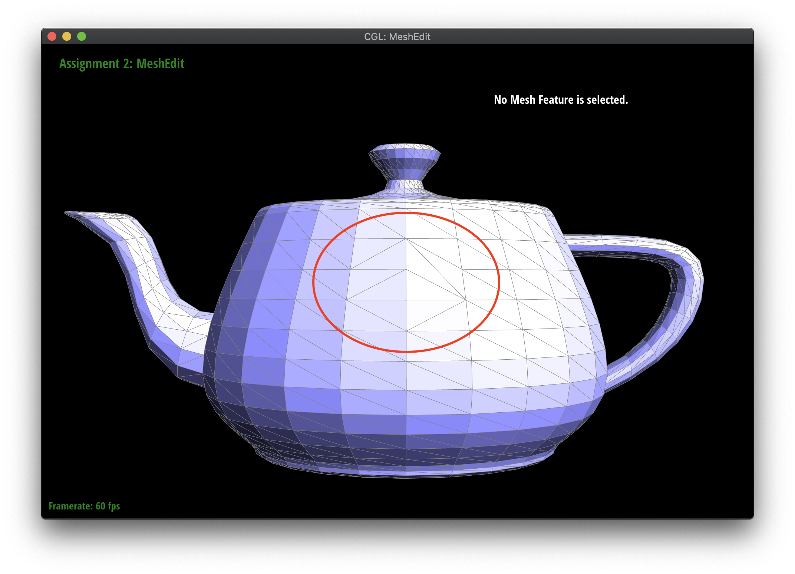

### Part 5: Edge Split (15 pts)

#### Answers
Steps to implement the edge split operation:
1. Given a certain `edge` variable, we first assign all the halfedges, vertices, faces to the corresponding data structures.

Example code (one example for each data structure):
```asm
HalfedgeIter h_0 = e0->halfedge();
VertexIter v_0 = h_0->vertex();
FaceIter f_0 = h_0->face();
```
2. Secondly, we create the midpoint (Vertex structure) in the center of the original edge. Meanwhile, we create new halfedges, edges, faces which are added alongside the midpoint.
3. Finally, we assign the neighbors for all halfedges, edges, faces. This part needs a lot debug!!!

Example code (one example for each data structure):
```asm
h_0->setNeighbors(h_1,h_3,midpoint,e0,f_0);
h_1->setNeighbors(h_2m,h_1->twin(),v_1,h_1->edge(),f_0);
e0->halfedge()=h_0;
f_0->halfedge()=h_0;
``` 

During the implementation, we notice that we have to be extremely careful when setting the new neighbors. One trick is to write down all the halfedges/edges and give a clear and systematic naming system, since we created a lot halfedges/edges.
For our implementation, we assigned a new halfedge to the original `e0.halfedge()`, we found that actually the direction of the halfedge can be assigned in either way, we just have to be consistent and follow the rules.

#### Results
* Before & After split

* Before & After split & After flip


My main debug experience is mainly on how to accurately set the halfedges. One trick we found useful is to name everything in a clear way, so that we can track which edges/halfedges are wrong.

### Part 6: Loop Subdivision for Mesh Upsampling (25 pts)
#### Answers
Steps to implement the loop subdivision.
1. We first loop through all the edges and assign the new position (interpolated by the neighbor vertices) to the edge, this will be used as the position for the generated midpoint during the edge split operation.

Code:
```asm
      for (EdgeIter edge = mesh.edgesBegin(); edge != mesh.edgesEnd(); edge++)
      {
          edge->isNew = false;
          HalfedgeIter h = edge->halfedge();
          VertexIter a = h->vertex();
          VertexIter b = h->twin()->vertex();
          VertexIter c = h->next()->next()->vertex();
          VertexIter d = h->twin()->next()->next()->vertex();
          edge->newPosition = (a->position+b->position)*(3.0f/8.0f) + (c->position+d->position)*(1.0f/8.0f);
      }
```
2. Secondly, we loop through all the vertices and assign the new positions.
```asm
      for (VertexIter v = mesh.verticesBegin();v!= mesh.verticesEnd(); v++)
      {
          v->isNew= false;
          int n_edge = 0;
          HalfedgeIter h = v->halfedge();
          Vector3D neighbors = Vector3D();
          do{
              n_edge +=1;
              h = h->twin()->next();
              neighbors += h->twin()->vertex()->position;
          }while(h!=v->halfedge() && !h->isBoundary());

          if (n_edge==3)
          {
              float u = 3.0f/16.0f;
              v->newPosition = (1-3*u)*v->position + u*neighbors;
          }
          else
          {
              float u = 3.0f/(8.0f*(float)n_edge);
              v->newPosition = (1-n_edge*u)*v->position + u*neighbors;
          }
      }
```
3. Now, we perform the split operation to the old edges. Originally, I thought that it will be the same as step 1, but it turned out that the new edges will be also included in the loop. Therefore, in the loop, we only processed the old edges with `e->isNew = false`.

Code:
```asm
      for (EdgeIter edge = mesh.edgesBegin(); edge!= mesh.edgesEnd(); edge ++)
      {
          if (edge->isNew && (((edge->halfedge()->vertex()->isNew)&&!(edge->halfedge()->twin()->vertex()->isNew))||(!(edge->halfedge()->vertex()->isNew)&&(edge->halfedge()->twin()->vertex()->isNew))))
          {
              mesh.flipEdge(edge);
          }
      }
```

4. Then, we flip any new edge that connects an old vertex and a new vertex.

Code:
```asm
      for (EdgeIter edge = mesh.edgesBegin(); edge!= mesh.edgesEnd(); edge ++)
      {
          if (edge->isNew && (((edge->halfedge()->vertex()->isNew)&&!(edge->halfedge()->twin()->vertex()->isNew))||(!(edge->halfedge()->vertex()->isNew)&&(edge->halfedge()->twin()->vertex()->isNew))))
          {
              mesh.flipEdge(edge);
          }
      }
```

5. Finally, we update the position of all vertices.

Code:
```asm
      for (VertexIter v = mesh.verticesBegin();v!= mesh.verticesEnd(); v++)
      {
          v->position = v->newPosition;
      }
```

#### Results
* Here show our results on loop subdivision:

As we can see, loop subdivision gives smaller meshes and a much more smooth surface, with more continuous textures.
Due to the interpolation, sharp corners and edges tends to be smoothed out.


* In this example (exported from blender, Top left), the 3D model has sharper corners and edges (e.g., the hat parts), if we directly perform loop subdivision (Top right), the edges will be smoothed out without keep its original shape.

One way to mitigate this is by pre-splitting the edges without interpolation (bottom left), then we are able to keep its original shape. Therefore, when we perform loop subdivision, we can see that the hat region with pre-splitting can better preserve the original shape.

* For the cube loop subdivision, the cube becomes slightly asymmetric after a few steps. From our viewpoint, its caused by the fact that the curvature at the vertex and midpoints are different.

One way to alleviate the effects is to make the initial mesh symmetric, here is an easy way - split the diagonal edges on each surface.


### Part 7: Design and Edit Your Own Mesh! (Optional, Possible Extra Credit)

In this part, we created a warriors with a shield and a sword using Blender.

This figure shows the results after a few steps of loop subdivision. The original warrior becomes a cute penguin-like figure.
Beside what has been introduced in the tutorial, I added the gesture of the figure, which involves rotation, scaling operations. We also create eyes to make the figure more vivid.

