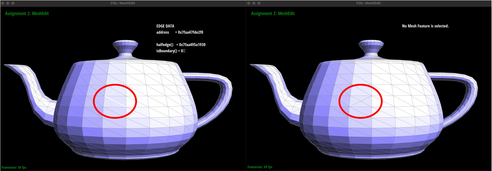

# Project 2 here
---
layout: default
title: Project 2 - MeshEdit
description: Ke Wang - Alfredo De Goyeneche
---

[Link to (this) Webpage](https://cal-cs184-student.github.io/sp22-project-webpages-asdegoyeneche/proj2/index.html)

[Link to Code](https://github.com/cal-cs184-student/p2-meshedit-sp22-mr_graphics_2)

## Part 5: Edge Split (15 pts)

### Answers
Steps to implement the edge split operation:
1. Given a certain `edge` variable, we first assign all the halfedges, vertices, faces to the corresponding data structures.

Example code (one example for each data structure):
```asm
HalfedgeIter h_0 = e0->halfedge();
VertexIter v_0 = h_0->vertex();
FaceIter f_0 = h_0->face();
```
2. Secondly, we create the midpoint (Vertex structure) in the center of the original edge. Meanwhile, we create new halfedges, edges, faces which are added alongside the midpoint.
3. Finally, we assign the neighbors for all halfedges, edges, faces. This part needs a lot debug!!!

Example code (one example for each data structure):
```asm
h_0->setNeighbors(h_1,h_3,midpoint,e0,f_0);
h_1->setNeighbors(h_2m,h_1->twin(),v_1,h_1->edge(),f_0);
e0->halfedge()=h_0;
f_0->halfedge()=h_0;
``` 

During the implementation, we notice that we have to be extremely careful when setting the new neighbors. One trick is to write down all the halfedges/edges and give a clear and systematic naming system, since we created a lot halfedges/edges.
For our implementation, we assigned a new halfedge to the original `e0.halfedge()`, we found that actually the direction of the halfedge can be assigned in either way, we just have to be consistent and follow the rules.

### Results
* Before & After split

* Before & After split & After flip


My main debug experience is mainly on how to accurately set the halfedges. One trick we found useful is to name everything in a clear way, so that we can track which edges/halfedges are wrong.

## Part 6: Loop Subdivision for Mesh Upsampling (25 pts)
### Answers
Steps to implement the loop subdivision.
1. We first loop through all the edges and assign the new position (interpolated by the neighbor vertices) to the edge, this will be used as the position for the generated midpoint during the edge split operation.

Code:
```asm
      for (EdgeIter edge = mesh.edgesBegin(); edge != mesh.edgesEnd(); edge++)
      {
          edge->isNew = false;
          HalfedgeIter h = edge->halfedge();
          VertexIter a = h->vertex();
          VertexIter b = h->twin()->vertex();
          VertexIter c = h->next()->next()->vertex();
          VertexIter d = h->twin()->next()->next()->vertex();
          edge->newPosition = (a->position+b->position)*(3.0f/8.0f) + (c->position+d->position)*(1.0f/8.0f);
      }
```
2. Secondly, we loop through all the vertices and assign the new positions.
```asm
      for (VertexIter v = mesh.verticesBegin();v!= mesh.verticesEnd(); v++)
      {
          v->isNew= false;
          int n_edge = 0;
          HalfedgeIter h = v->halfedge();
          Vector3D neighbors = Vector3D();
          do{
              n_edge +=1;
              h = h->twin()->next();
              neighbors += h->twin()->vertex()->position;
          }while(h!=v->halfedge() && !h->isBoundary());

          if (n_edge==3)
          {
              float u = 3.0f/16.0f;
              v->newPosition = (1-3*u)*v->position + u*neighbors;
          }
          else
          {
              float u = 3.0f/(8.0f*(float)n_edge);
              v->newPosition = (1-n_edge*u)*v->position + u*neighbors;
          }
      }
```
3. Now, we perform the split operation to the old edges. Originally, I thought that it will be the same as step 1, but it turned out that the new edges will be also included in the loop. Therefore, in the loop, we only processed the old edges with `e->isNew = false`.

Code:
```asm
      for (EdgeIter edge = mesh.edgesBegin(); edge!= mesh.edgesEnd(); edge ++)
      {
          if (edge->isNew && (((edge->halfedge()->vertex()->isNew)&&!(edge->halfedge()->twin()->vertex()->isNew))||(!(edge->halfedge()->vertex()->isNew)&&(edge->halfedge()->twin()->vertex()->isNew))))
          {
              mesh.flipEdge(edge);
          }
      }
```

4. Then, we flip any new edge that connects an old vertex and a new vertex.

Code:
```asm
      for (EdgeIter edge = mesh.edgesBegin(); edge!= mesh.edgesEnd(); edge ++)
      {
          if (edge->isNew && (((edge->halfedge()->vertex()->isNew)&&!(edge->halfedge()->twin()->vertex()->isNew))||(!(edge->halfedge()->vertex()->isNew)&&(edge->halfedge()->twin()->vertex()->isNew))))
          {
              mesh.flipEdge(edge);
          }
      }
```

5. Finally, we update the position of all vertices.

Code:
```asm
      for (VertexIter v = mesh.verticesBegin();v!= mesh.verticesEnd(); v++)
      {
          v->position = v->newPosition;
      }
```

### Results
* Here show our results on loop subdivision:

As we can see, loop subdivision gives smaller meshes and a much more smooth surface, with more continuous textures.
Due to the interpolation, sharp corners and edges tends to be smoothed out.


* In this example (exported from blender, Top left), the 3D model has sharper corners and edges (e.g., the hat parts), if we directly perform loop subdivision (Top right), the edges will be smoothed out without keep its original shape.

One way to mitigate this is by pre-splitting the edges without interpolation (bottom left), then we are able to keep its original shape. Therefore, when we perform loop subdivision, we can see that the hat region with pre-splitting can better preserve the original shape.

* For the cube loop subdivision, the cube becomes slightly asymmetric after a few steps. From our viewpoint, its caused by the fact that the curvature at the vertex and midpoints are different.

One way to alleviate the effects is to make the initial mesh symmetric, here is an easy way - split the diagonal edges on each surface.


## Part 7: Design and Edit Your Own Mesh! (Optional, Possible Extra Credit)
### Answers
In this part, we created a warriors with a shield and a sword using Blender.

This figure shows the results after a few steps of loop subdivision. The original warrior becomes a cute penguin-like figure.
Beside what has been introduced in the tutorial, I added the gesture of the figure, which involves rotation, scaling operations. We also create eyes to make the figure more vivid.

