[Link to (this) Webpage](https://cal-cs184-student.github.io/sp22-project-webpages-asdegoyeneche/proj3-1/index.html)

[Link to Code](https://github.com/cal-cs184-student/p3-1-pathtracer-sp22-mr_graphics_3)


# Project 3-1 Pathtracer

#### Overview

We utilized a pathtracing algorithm to implement the core routines of a physically-based renderer. We implemented functionality for ray generation and scene intersection, we accelerated the process by implementing a Bounding Volume Hierarchy data structure, we implemented direct and global illumination, and we finally implemented adaptive sampling to reduce noise in our images.


## Part I: Ray Generation and Scene Intersection

### Ray generation and primitive intersection

To generate rays we start from normalized image coordinates (x,y). We first must convert the image coordinates into the camera space and then into the world space. Our normalized image space is in the range of (0,0) to (1,1), and our camera space is in the range (-tan(0.5 * hFOV), -tan(0.5 * vFOV)) to (tan(0.5 * hFOV), tan(0.5 * vFOV)). This first transform is a simple linear mapping. Then, we convert the camera space coordinates into world space using the camera's camera-to-world rotation matrix `c2w`. Finally, the origin of our ray is the camera's position `p`. We have:

```
  Ray Camera::generate_ray(double x, double y) const {
    Vector3D direction = c2w * Vector3D(tan(radians(hFov / 2)) * (2 * x - 1),
                                        tan(radians(vFov / 2)) * (2 * y - 1),
                                        -1);
    direction.normalize();

    return Ray(pos, direction);
  }
```

We then use this `generate_ray` function when we estimate the radiance for pixel samples. For each sample we create a ray, and this ray will later intersect elements in the scene. The code looks as follows (remember that `generate_ray` takes normalized coordinates):

```
  Vector3D average_radiance;
  for (int i = 0; i < num_samples; ++i) {
    Vector2D offset = gridSampler->get_sample();
    Ray ray = camera->generate_ray((x + offset.x) / sampleBuffer.w, (y + offset.y) / sampleBuffer.h);
    average_radiance += est_radiance_global_illumination(ray)  / (double) num_samples;
  }
```

Finally, we intersect primitives. There are two functions we implement for each primitive: `has_intersection(const Ray &r)` and `intersect(const Ray &r, Intersection *i)`. The first one simple checks if there's an intersection between the primitive and the input ray. The second also reports the nearest intersection point (including the location by reporting the time parameter for the ray, the surface normal at intersection, and also reports the surface material BSDF). 

To intersect a primitive we need to find if there's a valid time t at the intersection point. This time has to be positive and be within the range of the ray's `min_t` and `max_t`. This range is initially set to `nclip` and `fclip` where everything outside this range is invisible to the camera. Every time we intersect a triangle we update the `max_t` parameter with the current intersection time in order to keep to closest intersection.


### Triangle intersection algorithm

We implemented two algorithms to intersect triangles. I will explain one of them: the Moller Trumbore Algorithm.
The Moller Trumbore Algorithm is an optimized version of triangle intersection with a ray that allows fast computation requiring 1 division, 27 multiplications and 17 add operations. With this algorithm, we obtain the time of intersection `t`, and the intersection in barycentric coordinates (`b0`, `b1`, `b2`). The algorithm takes triangle vertices, ray origin `O` and ray direction `D` as inputs. We seek to solve `O + t*D = (1-b1-b2)*P0 + b1*P1 + b2*P2`, where `P0`, `P1`, `P2` are the triangle vertex coordinates. Slide from class:

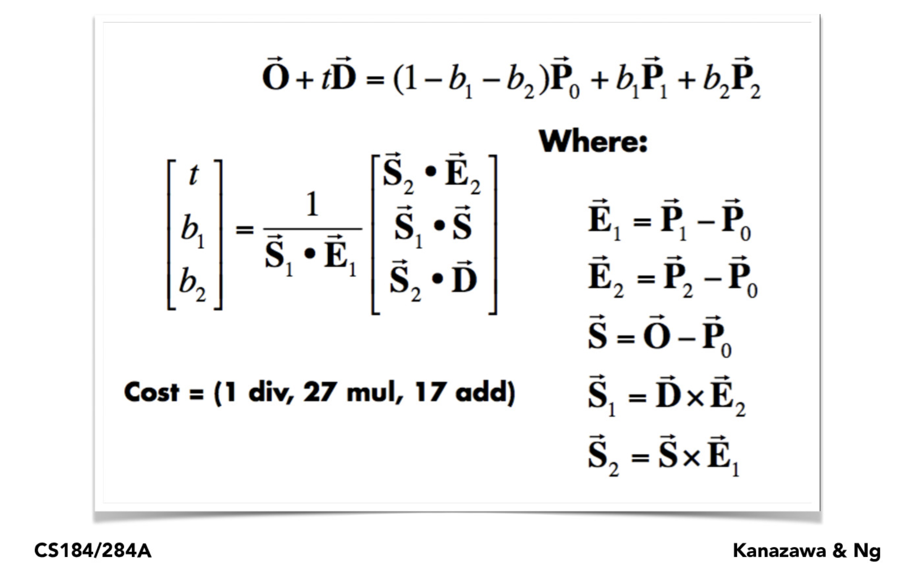

To optimize a bit the computation, we computed the barycentric coordinates only if the intersection time was valid. With the barycentric coordinates we can compute the average normal at the intersection point easily. The code is as follows:

```
  Vector3D E1 = p2 - p1;
  Vector3D E2 = p3 - p1;
  Vector3D S = r.o - p1;
  Vector3D S1 = cross(r.d, E2);
  Vector3D S2 = cross(S, E1);

  double divisor = dot(S1, E1);
  double t = dot(S2, E2) / divisor;

  if (t >= 0 && t >= r.min_t && t <= r.max_t) {  // intersects the plane with t in valid range
    double b2 = dot(S1, S) / divisor;  // baricentric coefficient for vertex 2
    double b3 = dot(S2, r.d) / divisor;  // baricentric coefficient for vertex 3
    double b1 = 1 - b2 - b3;

    if (b1 >= 0 && b2 >= 0 && b3 >= 0) {  // intersects the triangle!
      r.max_t = t;  // Update ray's max intersection time!
      isect->t = t;
      isect->n = b1 * n1 + b2 * n2 + b3 * n3;  // Let's get the mean normal at the intersection point
      isect->primitive = this;
      isect->bsdf = get_bsdf();
      return true;
    }
  }
  return false;
```

### Results

Here are a few .dae examples with normal shading:

| `CBempty.dae`           |  `CBgems.dae`        |
|:-------------------------:|:-------------------------:|
|   |    | 
| `CBspheres.dae`         |  |
|    |  |


## Part II: Bounding Volume Hierarchy (BVH)


### BVH construction & heuristic

Iterating over each primitive in the scene is not scalable, therefore a better data structure was needed. We implemented a BVH structure with simple heuristics that allows us to reduce computation from an O(n) time complexity to O(log(n))!

To construct the BVH, which has a tree structure, we wrote the `construct_bvh(std::vector<Primitive *>::iterator start, std::vector<Primitive *>::iterator end, size_t max_leaf_size)` function, which starts with the root node and goes on recursively. On every recursive call, we first compute the node's bounding box by combining the bounding box of each primitive in the subtree that starts from this node. To do this, we iterate the primitives in the subtree from `start` to `end` and used the `Bbox::expand` function. We also compute the mean centroid position for the elements in the bounding box, which will be used later in our heuristic. This part of the code looks as follows:

```
  BBox bbox;
  int num_elements = end - start;
  Vector3D mean_centroid = Vector3D();

  for (auto p = start; p != end; p++) {
    BBox bb = (*p)->get_bbox();
    bbox.expand(bb);
    mean_centroid += bb.centroid();  // might want to compute only if more than max_leaf_size elements
  }

  mean_centroid /= num_elements;
  BVHNode *node = new BVHNode(bbox);
```

If the number of elements (`num_elements`) under this node is less than the `max_leaf_size`, then we are in a leaf and we assign the node's start and end iterators to the function's input start and end. There's nothing else to do here and we proceed to return the node:

```
  if (num_elements < max_leaf_size) {
    // if less than max_leaf_size elements just return with bounding box
    node->start = start;
    node->end = end;
    return node;
  }
```

Now, if we have more than `max_leaf_size` nodes, we need to choose along what axis to split our primitives and where within that axis to split. A simple heuristic we implemented consists of splitting the axis that has the largest length in the bounding box extent, and splitting at the centroid location of that axis. Finally, once we have the split, we assign the left and right child of the current node as the output of `construct_bvh` for each of the splits. This heuristic was both simple to implement and quick to run, and obtained good results. The code for this looks as follows:

```
  } else {  // more than `max_leaf_size` elements
   
    double max_extent = max(bbox.extent.x, max(bbox.extent.y, bbox.extent.z));
    double split_point;
    std::vector<Primitive *>::iterator bound;

    if (bbox.extent.x == max_extent) {  // split along X
      split_point = mean_centroid.x;
      bound = partition(start, end, [split_point](Primitive *primitive) {
                          return primitive->get_bbox().centroid().x <= split_point;
                        }
      );
    } else if (bbox.extent.y == max_extent) {  // split along Y
      split_point = mean_centroid.y;
      bound = partition(start, end, [split_point](Primitive *primitive) {
                          return primitive->get_bbox().centroid().y <= split_point;
                        }
      );
    } else {    // split along Z
      split_point = mean_centroid.z;
      bound = partition(start, end, [split_point](Primitive *primitive) {
                          return primitive->get_bbox().centroid().z <= split_point;
                        }
      );
    }

    if (bound - start == 0 || end - bound == 0){  // everyone has same centroid, just split in two here
      bound = start;
      for (int i = 0; i < (end-start) / 2; bound++, i++);
    }

    node->l = construct_bvh(start, bound, max_leaf_size);
    node->r = construct_bvh(bound, end, max_leaf_size);

  }

  return node;
``` 

In some rare cases, the centroid of all elements in the subtree was the same, which caused the initial version of this heuristic to fail. In this cases, we would just split the primitives in half. This happened just one case one level before the leaf level, where we had four elements left with the same centroid along the largest extent axis.

We also implemented another heuristic first, which would split just at the middle of the bounding box, but this heuristic tended to throw segfault more often. Finally, we also implemented a version that would split along the axis that would generate the most equal split. To do this, we would count how the split would distribute if separating along the subtree average primitive centroid.

### Results

Here are some images with normal shading that are possible to compute super fast with our BVH acceleration. 

| `maxplanck.dae`           | `beast.dae`           |
|:-------------------------:|:-------------------------:|
|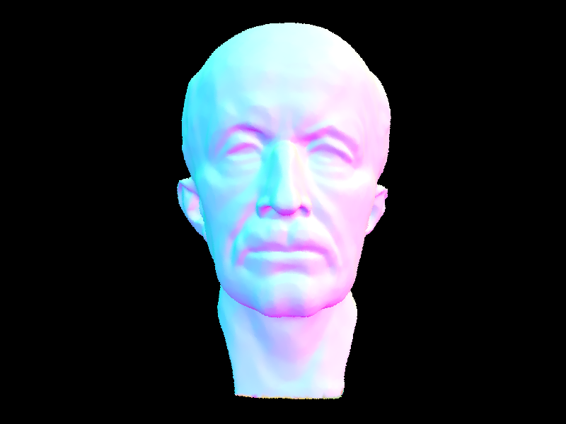   | 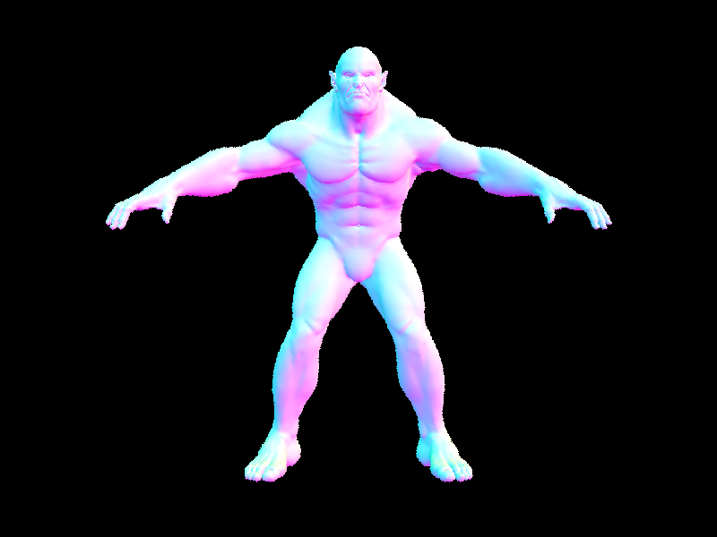   | 
| `CBlucy.dae`           |  `blob.dae`        | 
| 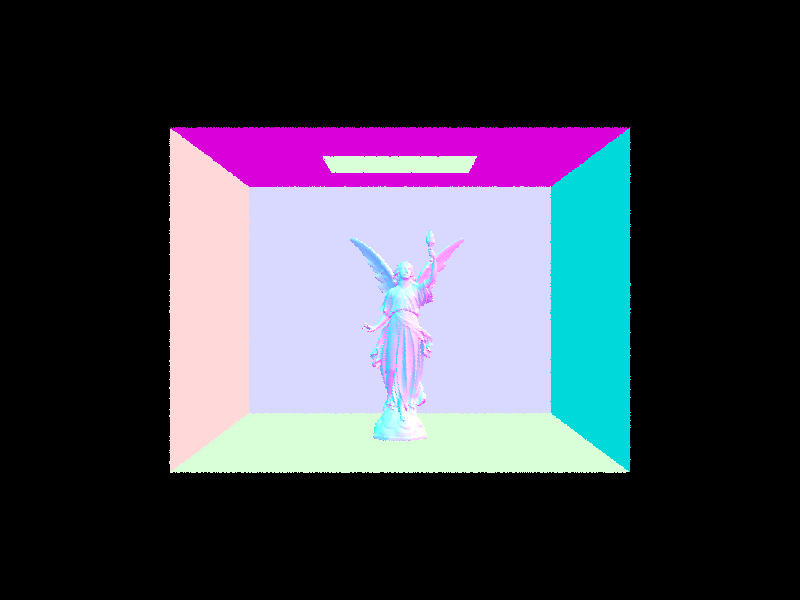   | 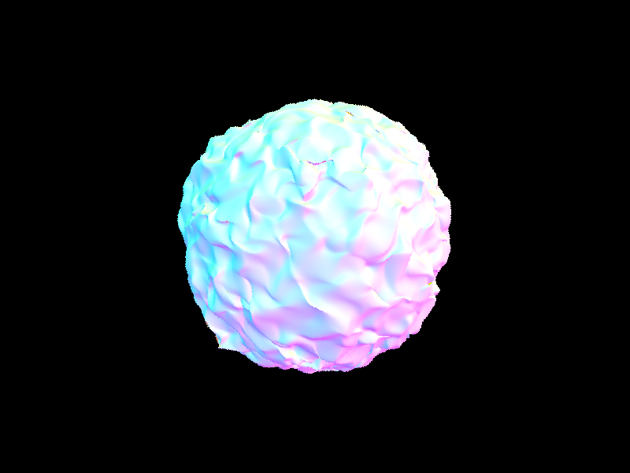   | 
|`wall-e.dae`         |  |
|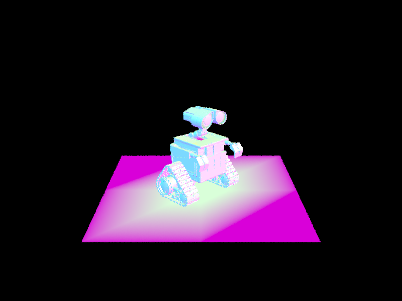   |  |


### BVH acceleration results and analysis

We benchmarked a few files in a 2019 MacBook Pro using 8 threads and producing an 800x600 image:

| Filename               | # of primitives |  Render time without BVH         |  Render time with BVH |
| :-------------------------:|:-------------------------:|:-------------------------:|:-------------------------:|
| `cow.dae`       | 5856         | 20.12s        | 0.0457s   |
| `maxplanck.dae` | 50801         | 221.82s      | 0.0524s  |
| `beast.dae`     | 64618         | 385.32s       | 0.0406s  |
| `CBlucy.dae`    | 133796        | Too long      | 0.0430s  |
| `blob.dae`      | 196608        | Too long      | 0.0558s  |
| `wall-e.dae`    | 240326        | Too long      | 0.0579s  |

As we can see, by using BVH acceleration we have that rendering time almost doesnt suffer when we increase the number of primitives. From the `cow.dae` to the `maxplanck.dae` we have about 10 times the number of primitives, and as a result the render without BVH takes about 10 times longer (which is what we expected! o(n)). On the other hand, the time with BVH implementation barely changes over all renderings. We would expect the time to increase around 25% from the cow to maxplanck (log(50801) / log(5856)), however, it seems that at this point the data structure is quite efficient that the bottleneck is in other operations in the pipeline. BVH is great!


## Part III: Direct Illumination

### Direct lighting function

### Results for both implementations fo direct lighting function

### Effect of number of light rays with 1 sample per pixel

### Analysis


## Part IV: Global Illumination

### Implementation of the indirect light function
In this part, we implemented the algorithm to perform indirect light rendering. Recall from Part 3, where we successfully implemented `one_bounce_radiance` function. Here, we recursively call that function to estimate the higher bounces.
Specifically, assume we have the intersection for the first bounce, we can create a new ray starting from the intersection with a sampled input light direction. Then, we can recursively call the `one_bounce_radiance` on top of the new rays.
To save the computation, we also implemented Russian Roulette for unbiased random termination. 

Our codes:
```asm
Vector3D PathTracer::at_least_one_bounce_radiance(const Ray &r,
                                                  const Intersection &isect) {
  Matrix3x3 o2w;
  make_coord_space(o2w, isect.n);
  Matrix3x3 w2o = o2w.T();

  Vector3D hit_p = r.o + r.d * isect.t;
  Vector3D w_out = w2o * (-r.d);

  Vector3D L_out = one_bounce_radiance(r,isect);

  double termination = 0.4;

  if (r.depth == 1)
  {
      return L_out;
  }

  Vector3D wi;
  double pdf;

  Vector3D f = isect.bsdf->sample_f(w_out,&wi,&pdf);
  Vector3D wi_world = o2w * wi;
  Ray next_ray = Ray(hit_p,wi_world);
  next_ray.depth = r.depth - 1;
  next_ray.min_t = EPS_F;
  Intersection next_intersection;
  bool next_isec_bool = bvh->intersect(next_ray,&next_intersection);
  if (next_isec_bool)
  {
      if (r.depth == max_ray_depth)
      {
          L_out += at_least_one_bounce_radiance(next_ray,next_intersection)*f* cos_theta(wi)/pdf;
      }
      else if (coin_flip(1-termination))
      {
          L_out += at_least_one_bounce_radiance(next_ray,next_intersection)*f* cos_theta(wi)/(pdf*(1-termination));

      }
  }
  return L_out;
```

### Results
#### 1. Images rendered with global (direct and indirect) illumination (Using 1024 samples)

| Direct illumination (m=1)          |                   Indirect illumination (m=5)        |            
| :-------------------------:|:----------------------------------------------------------------: |
| Bunny Results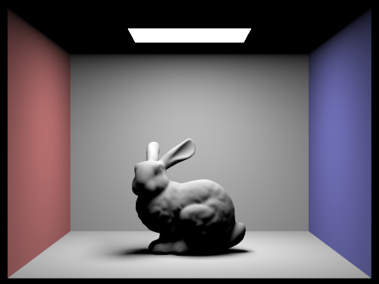   |  Bunny Results  |  
| Sphere Results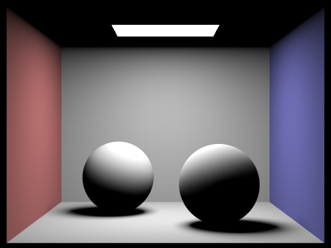   | Bunny Results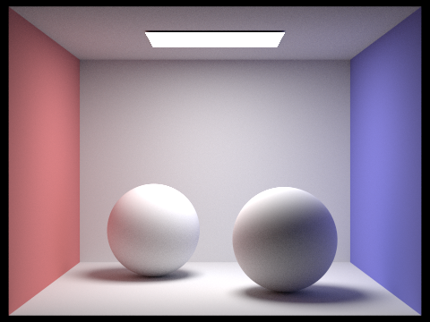 |  

#### 2. Images rendered with only `direct` illumination and only `indirect` illumination (Using 1024 samples)

| Only Direct illumination (m=1)          |                    Only Indirect illumination (m=3)        |              
| :-------------------------:|:-----------------------------------------------------------------------:|
|Bunny Results   | Bunny Results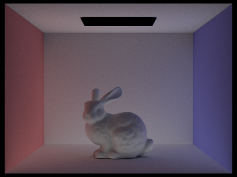 |

#### 3. Images rendered with different `max_ray_depth` (Using 1024 samples)

| m=0        |                               m=1                      |          
|:-------------------------:|:---------------------------------------------------------------:|
| Bunny Results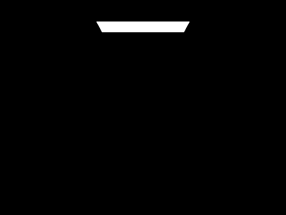   | Bunny Results  |
|m=2        |                               m=3              |                 
| Bunny Results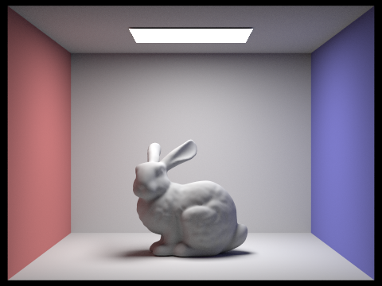   | Bunny Results |
| m=100      |           |                                                  
| Bunny Results   | |

#### 4. Images rendered with different `sample-per-pixel` rates. (m=3)
| s=1        |                                s=2       |                          
| :-------------------------:|:-----------------------------------------------------------------:|
| Dragon Results   | Dragon Results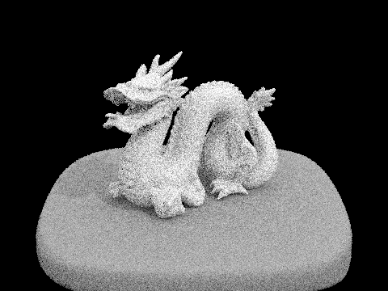 |
| s=4        |                                s=8    |                      
| Dragon Results   | Dragon Results |
| s=16      | s=64 |
| Dragon Results | Dragon Results |
| s=1024     |  |  
| Dragon Results|  |


## Part V: Adaptive Sampling

To implement the adaptive sampling, we computed the average `mu` and variance `sigma^2` every `samplesPerBatch` samples, and terminate the sampling when `I<=maxTolerance*mu`, where `I = 1.96* sqrt(sigma_2)/sqrt(actual_sample)`.
Our implementatin codes:
```asm
void PathTracer::raytrace_pixel(size_t x, size_t y) {
  int num_samples = ns_aa;          // total samples to evaluate
  Vector2D origin = Vector2D(x, y); // bottom left corner of the pixel
  Vector3D illum_average = Vector3D();
  double weight = 1/(float)num_samples;
  double s1 = 0;
  double s2 = 0;
  int actual_sample = 0;
  for (int i = 0; i< num_samples; i++)
  {
      if (i!=0 && (i % samplesPerBatch) ==0)
      {
          double mu = s1/double(actual_sample);
          double sigma_2 = (1/(double(actual_sample)-1))*((s2)-(s1*s1/(actual_sample)));
          double I = 1.96* sqrt(sigma_2)/sqrt(actual_sample);
          if (I<=maxTolerance*mu)
          {
              break;
          }
      }
      Vector2D xy_sub = gridSampler->get_sample();
      double x_image = (x+xy_sub.x)/sampleBuffer.w;
      double y_image = (y+xy_sub.y)/sampleBuffer.h;
      Ray ray_sample = camera->generate_ray(x_image,y_image);
      ray_sample.depth = max_ray_depth;
      Vector3D radiance = est_radiance_global_illumination(ray_sample);
      s1 += radiance.illum();
      s2 += (radiance.illum())*(radiance.illum());
      illum_average = illum_average + radiance;
      actual_sample++;

  }
  illum_average = illum_average/actual_sample;


  sampleBuffer.update_pixel(illum_average, x, y);
  sampleCountBuffer[x + y * sampleBuffer.w] = actual_sample;


}
```

### Results
Images rendered with adaptive sampling.

| Rendered image        |                            Sampling rate               |               
| :-------------------------:|:--------------------------------------------------------------------:|
| Bunny Results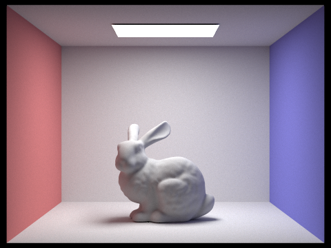   | Bunny Results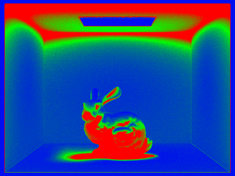 |

We can see clearly visible differences in sampling rate over various regions and pixels.