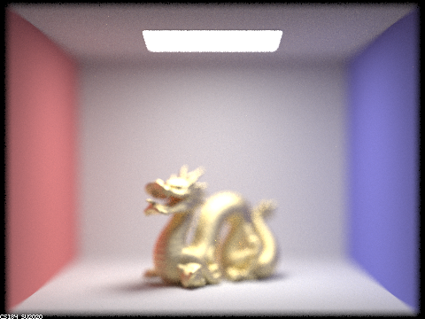
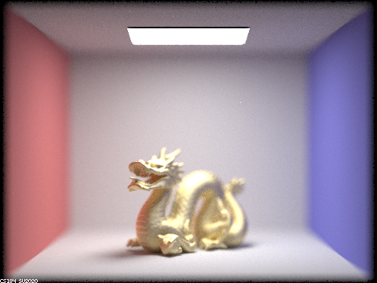
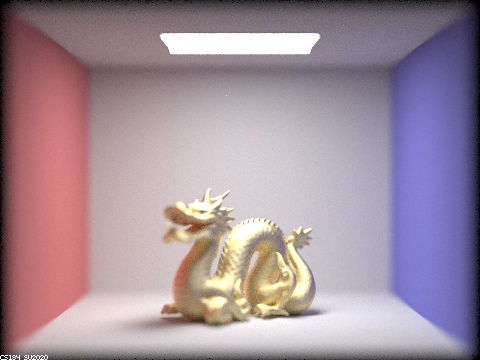
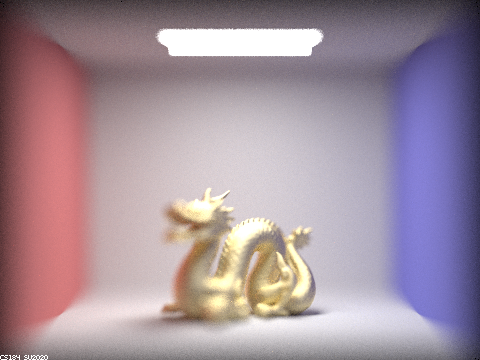

[Link to (this) Webpage](https://cal-cs184-student.github.io/sp22-project-webpages-asdegoyeneche/proj3-2/index.html)

[Link to Code](https://github.com/cal-cs184-student/p3-2-pathtracer-sp22-mr_graphics_3_2)

# Project 3-2 Pathtracer II

#### Overview

Please grade parts 2 and 4.

## Part I: Mirror and Glass Materials (Graded).

Here we show a sequence of six images of the scene `CBspheres.dae` rendered with various `max_ray_depth`. We used 256 samples per pixel and 4 samples per light:

| m = 0 |                      m=1         |
|:------------------:|:--------------:|
|       |  | 
|    m=2               |            m=3      |
|      |   |
|    m=4               |            m=5      |
|      |   |
|    m=100               |        |
|      | |

We have that the first image we only see the light source, which makes sense since we have no bounces. On the next level, with one bounce, the walls and floor get illuminated (direct illumination), as well as the areas of the light that gets directly reflected on the spheres to the camera. Here the right sphere (glass) has some chance of reflecting based on the Schlick's reflection coefficient, so it's not as smooth as the left one. Also, note that the region occluded by the spheres is dark (shadow for now).
  In the next bounce (m=2), we can see light from the walls and floor reaching the spheres. The left sphere only reflects and we see the scene of m=1 reflected on it; the sphere on the right mostly refracts so it looks much darker, so most of the rays are travelling through the sphere in this bounce and will show up in the next bounce. We also have light reaching the roof at this bounce from whatever was illuminated in the previous bounce.
  At m=3, the light travelling through the right sphere exits the sphere and displays signal that can be seen now - we can now see under the sphere's shadow the light from the main light source reaching the floor. The left sphere now reflects light from the ceiling and its shadow also receives more illumination. 
  At m=4 we have that the light reflection on the left sphere reaches the right wall! (At m=1 reaches the left sphere, at m=2 reaches the right sphere after reflection, at m=3 travels through right sphere with refraction, and now at m=4 reaches the right wall). We can also see the light that bounces back from the floor back to the right sphere, this light partially reflects so we can see some illumination at the bottom of the sphere, and the rest refracts back inside the sphere. 
  After this bounce, the main actors in reflection and refraction of the illumination have played and we have mostly converged, as we can see that m=4 looks quite similar to m=5 and m=100. 

## Part II: Microfacet Material (Extra)

1. Scene `CBdragon_microfacet_au.dae` rendered with  set to 0.005, 0.05, 0.25 and 0.5. 128 samples per pixel, 4 samples per light and max_ray_depth of 5.

|  = 0.005 |                      0.05                      |
|:--------------------------------------------------------------------------------:|:----------------------------------------------:|
|                                   |  | 
|                                       0.25                                       |                      0.5                       |
|                                    |   |

As shown in the figures,  represents the roughness of the macro surface. Lower  corresponds to smoother surface (more like mirror), while higher  corresponds to rougher material (more like diffuse material).

2. Scene `CBbunny_microfacet_cu.dae` rendered using cosine hemisphere sampling (default) and importance sampling. Using 64 samples per pixel and 1 sample per light in each.

|        Default cosine hemisphere sampling        |                 Importance sampling                 |
|:------------------------------------------------:|:---------------------------------------------------:|
|  |  | 

As shown in the figures, the importance sampling have much lower noise level and better rendered image quality. In contrast, since the default sampling strategy samples uniformly on the hemisphere, which results in a lower effective sampling rate and higher noise level (some of the sampling directions are not feasible for the material).  

3. For the `CBdragon_microfacet_au.dae` scene, we modified the material from Au (gold) to Fe (iron) and Mg (Magnesium).
   
    parameters for Fe: R-614nm: eta = 3.1700, k = 6.1200; G-549nm: eta = 2.9500, k = 2.9300; B-466nm: eta = 2.6500, k = 2.8075.

    parameters for Mg: R-614nm: eta = 0.37635, k = 5.6806; G-549nm: eta = 0.31405, k = 5.0262; B-466nm: eta = 0.23451, k = 4.1906.

|                         Fe                          |                         Mg                          |
|:---------------------------------------------------:|:---------------------------------------------------:|
|  |  | 

Look nice!!

## Task IV: Depth of Field (Graded)

| d = 4.3 |                      d=4.5         |
|:------------------:|:--------------:|
|       |  | 
|    d=4.7               |            d=4.9      |
|      |   |

| b = 0.1 |                      b=0.2  |
|:------------------:|:--------------:|
|       |  | 
|    b=0.3          |            b=0.5      |
|      |   |

## Note on collaboration

We've been working together since the first project, as well as collaborating in research in our lab. For the CS284A course projects we've worked independently on the each task of the coding part of the assignment (in separate branches), and we would discuss issues / point out bugs / discuss alternative implementations. At the end we would either merge one of the two branches into master or combine parts of each branch. Now, for the write-up, we usually split the tasks. This has been working since we both have tight schedules and allows both of us to dig into the code (and learn in this process).

