[Link to (this) Webpage](https://cal-cs184-student.github.io/sp22-project-webpages-asdegoyeneche/proj3-2/index.html)

[Link to Code](https://github.com/cal-cs184-student/p3-2-pathtracer-sp22-mr_graphics_3_2)

# Project 3-2 Pathtracer II

#### Overview

Please grade parts 1 and 4.

## Part I: Mirror and Glass Materials (Graded)

| m = 0 |                      m=1         |
|:------------------:|:--------------:|
|       | 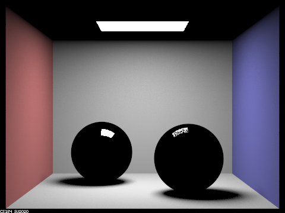 | 
|    m=2               |            m=3      |
|   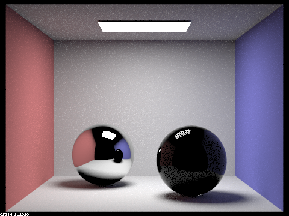   | 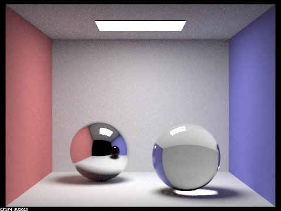  |
|    m=4               |            m=5      |
|   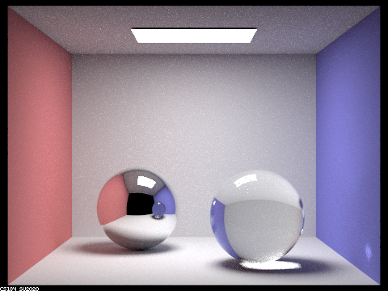   | 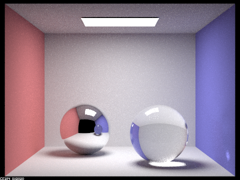  |
|    m=100               |        |
|   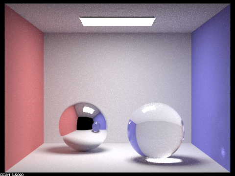   | |

## Part II: Microfacet Material (Extra)

1. Scene `CBdragon_microfacet_au.dae` rendered with  set to 0.005, 0.05, 0.25 and 0.5. 128 samples per pixel and 4 samples per light.

|  = 0.005 |                      0.05                      |
|:--------------------------------------------------------------------------------:|:----------------------------------------------:|
|                 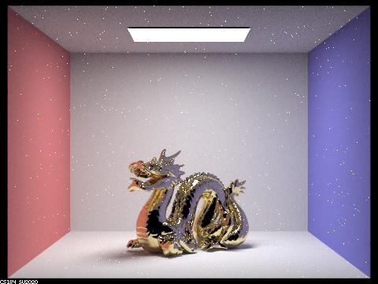                  | 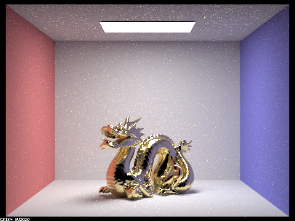 | 
|                                       0.25                                       |                      0.5                       |
|                  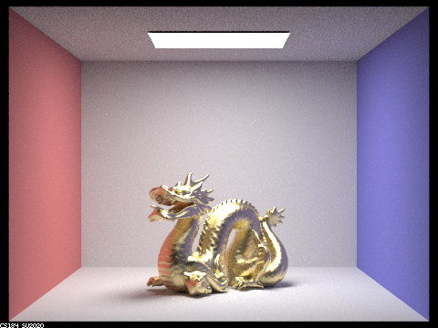                  | 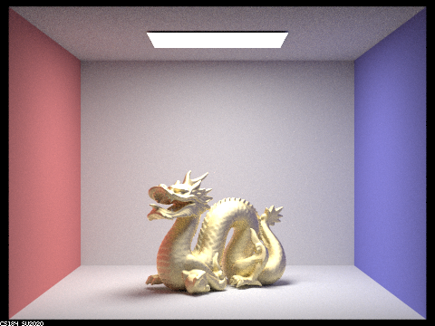  |

As shown in the figures,  represents the roughness of the macro surface. Lower  corresponds to smoother surface (more like mirror), while higher  corresponds to rougher material (more like diffuse material).

2. Scene `CBbunny_microfacet_cu.dae` rendered using cosine hemisphere sampling (default) and importance sampling. Using 64 samples per pixel and 1 sample per light in each.

|        Default cosine hemisphere sampling        |                 Importance sampling                 |
|:------------------------------------------------:|:---------------------------------------------------:|
| 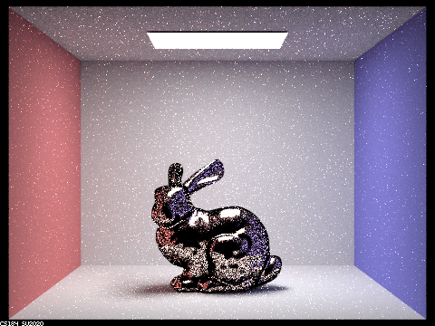 | 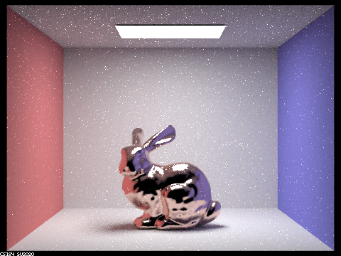 | 

As shown in the figures, the importance sampling have much lower noise level and better rendered image quality. In contrast, since the default sampling strategy samples uniformly on the hemisphere, which results in a lower effective sampling rate and higher noise level (some of the sampling directions are not feasible for the material).  

3. For the `CBdragon_microfacet_au.dae` scene, we modified the material from Au (gold) to Fe (iron) and Mg (Magnesium).
   
    parameters for Fe: R-614nm: eta = 3.1700, k = 6.1200; G-549nm: eta = 2.9500, k = 2.9300; B-466nm: eta = 2.6500, k = 2.8075.

    parameters for Mg: R-614nm: eta = 0.37635, k = 5.6806; G-549nm: eta = 0.31405, k = 5.0262; B-466nm: eta = 0.23451, k = 4.1906.

|                         Fe                          |                         Mg                          |
|:---------------------------------------------------:|:---------------------------------------------------:|
| 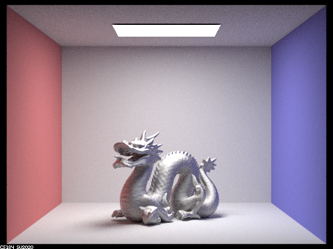 | 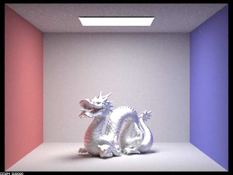 | 

Look nice!!

## Task IV: Depth of Field (Graded)

| d = 4.3 |                      d=4.5         |
|:------------------:|:--------------:|
|   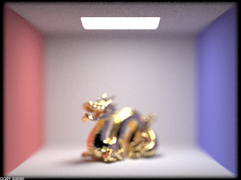    | 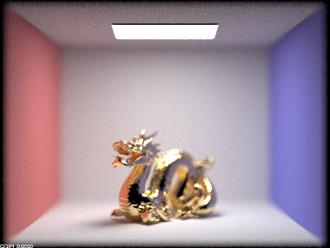 | 
|    d=4.7               |            d=4.9      |
|   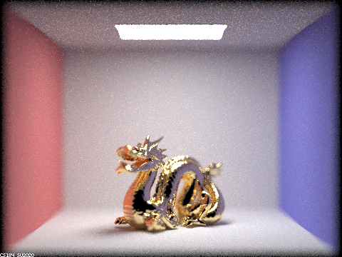   | 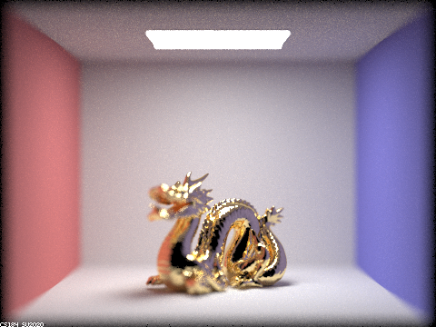  |

## Note on collaboration

We've been working together since the first project, as well as collaborating in research in our lab. For the CS284A course projects we've worked independently on the each task of the coding part of the assignment (in separate branches), and we would discuss issues / point out bugs / discuss alternative implementations. At the end we would either merge one of the two branches into master or combine parts of each branch. Now, for the write-up, we usually split the tasks. This has been working since we both have tight schedules and allows both of us to dig into the code (and learn in this process).

