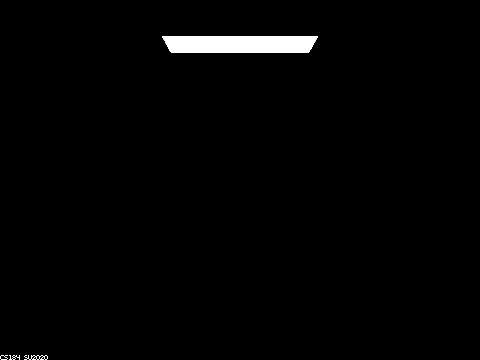

[Link to (this) Webpage](https://cal-cs184-student.github.io/sp22-project-webpages-asdegoyeneche/proj3-2/index.html)

[Link to Code](https://github.com/cal-cs184-student/p3-2-pathtracer-sp22-mr_graphics_3_2)


# Project 3-2 Pathtracer II

#### Overview

In this project, we added additional features to our ray tracer! These included new materials involving reflection and/or refraction such as mirror and glass, and microfacet material. We also simulated a thin-lens camera model, where we were able to generate images with different planes of focus and lens radius obtaining different levels of blurring!

Please grade parts 2 and 4.


## Part I: Mirror and Glass Materials (Graded).


Here we show a sequence of six images of the scene `CBspheres.dae` rendered with various `max_ray_depth`. We used 256 samples per pixel and 4 samples per light:

| m = 0 |                      m=1         |
|:------------------:|:--------------:|
|       |  | 
|    m=2               |            m=3      |
|      |   |
|    m=4               |            m=5      |
|      |   |
|    m=100               |        |
|      | |

We have that the first image we only see the light source, which makes sense since we have no bounces. On the next level, with one bounce, the walls and floor get illuminated (direct illumination), as well as the areas of the light that gets directly reflected on the spheres to the camera. Here the right sphere (glass) has some chance of reflecting based on the Schlick's reflection coefficient, so it's not as smooth as the left one. Also, note that the region occluded by the spheres is dark (shadow for now).
  
  In the next bounce (m=2), we can see light from the walls and floor reaching the spheres. The left sphere only reflects and we see the scene of m=1 reflected on it; the sphere on the right mostly refracts so it looks much darker, so most of the rays are travelling through the sphere in this bounce and will show up in the next bounce. We also have light reaching the roof at this bounce from whatever was illuminated in the previous bounce.
  
  At m=3, the light travelling through the right sphere exits the sphere and displays signal that can be seen now - we can now see under the sphere's shadow the light from the main light source reaching the floor. The left sphere now reflects light from the ceiling and its shadow also receives more illumination. 
 
 At m=4 we have that the light reflection on the left sphere reaches the right wall! (At m=1 reaches the left sphere, at m=2 reaches the right sphere after reflection, at m=3 travels through right sphere with refraction, and now at m=4 reaches the right wall). We can also see the light that bounces back from the floor back to the right sphere, this light partially reflects so we can see some illumination at the bottom of the sphere, and the rest refracts back inside the sphere. 
  
  After this bounce, the main actors in reflection and refraction of the illumination have played and we have mostly converged, as we can see that m=4 looks quite similar to m=5 and m=100. 


#### Code

To achieve rendering of Mirror and Glass materials, we had to code reflection and refraction, and then use these for Mirror (reflection) and Glass (reflection and refraction).

Reflection is quite simple, we just negate x and y coordinates of `wo` and we assign this new vector to `wi`. 
```
void BSDF::reflect(const Vector3D wo, Vector3D* wi) {
  *wi = Vector3D(-wo.x, -wo.y, wo.z);
}
```

For the case of refraction, we need to consider if there's total internal reflection, where in that case we return false as we don't refract, otherwise we use Snell's law to refract wo. If entering or exiting the material, we would use different index of refraction `eta = 1/ior` (if entering) or `eta = 1/ior` (if exiting). The code looks as follows:
```
bool BSDF::refract(const Vector3D wo, Vector3D* wi, double ior) {
  // Normal is (0, 0, 1), then dot(wo, n) is just wo.z
  double eta = (wo.z > 0) ? 1 / ior : ior;  // ray entering the surface if wo.z > 0
  double wi_z_squared = 1 - eta * eta * (1 - wo.z * wo.z);

  if (wi_z_squared < 0) {  // total internal reflection
    return false;
  }

  *wi = Vector3D(-eta * wo.x, -eta * wo.y, sqrt(wi_z_squared));
  if (wo.z > 0) {
    wi->z *= -1;
  }
  return true;
}
```

Finally, for the Mirror material, we just reflect, set the pdf to 1 and return the reflectance over the cosine of the incident ray angle:
```
Vector3D MirrorBSDF::sample_f(const Vector3D wo, Vector3D* wi, double* pdf) {
  *pdf = 1.0;
  reflect(wo, wi);
  return reflectance / abs_cos_theta(*wi);
}
```
The glass material is a bit more involved: If we have total internal reflection we just reflect and return the same as the mirror case. Otherwise, we compute the Schlick's reflection coefficient R and flip a coin with R probability to decide if we reflect or refract. The code looks as follows:
```
Vector3D GlassBSDF::sample_f(const Vector3D wo, Vector3D* wi, double* pdf) {
  if (!refract(wo, wi, ior)) {  // total internal reflection
    reflect(wo, wi);
    *pdf = 1.0;
    return reflectance / abs_cos_theta(*wi);
  }
  // else either reflection or refraction, based on coin flip with Schlick's approximation.

  double eta = (wo.z > 0) ? 1 / ior : ior;  // ray entering the surface if wo.z > 0
  double R = pow((1 - eta) / (1 + eta), 2);  // compute R0 first
  R = R + (1 - R) * pow((1 - abs_cos_theta(wo)), 5);

  if (coin_flip(R)) {
    reflect(wo, wi);
    *pdf = R;
    return R * reflectance / abs_cos_theta(*wi);
  } else {
    // wi is already assigned when refracting
    *pdf = 1 - R;
    return (1 - R) * transmittance / abs_cos_theta(*wi) / (eta * eta);
  }
}
```

That's it!

## Part II: Microfacet Material (Extra)

1. Scene `CBdragon_microfacet_au.dae` rendered with  set to 0.005, 0.05, 0.25 and 0.5. 128 samples per pixel, 4 samples per light and max_ray_depth of 5.


|  = 0.005 |                      0.05                      |
|:--------------------------------------------------------------------------------:|:----------------------------------------------:|
|                                   |  | 
|                                       0.25                                       |                      0.5                       |
|                                    |   |

As shown in the figures,  represents the roughness of the macro surface. Lower  corresponds to smoother surface (more like mirror), while higher  corresponds to rougher material (more like diffuse material).

2. Scene `CBbunny_microfacet_cu.dae` rendered using cosine hemisphere sampling (default) and importance sampling. Using 64 samples per pixel and 1 sample per light in each.

|        Default cosine hemisphere sampling        |                 Importance sampling                 |
|:------------------------------------------------:|:---------------------------------------------------:|
|  |  | 

As shown in the figures, the importance sampling have much lower noise level and better rendered image quality. In contrast, since the default sampling strategy samples uniformly on the hemisphere, which results in a lower effective sampling rate and higher noise level (some of the sampling directions are not feasible for the material).  

3. For the `CBdragon_microfacet_au.dae` scene, we modified the material from Au (gold) to Fe (iron) and Mg (Magnesium).
   
    parameters for Fe: R-614nm: eta = 3.1700, k = 6.1200; G-549nm: eta = 2.9500, k = 2.9300; B-466nm: eta = 2.6500, k = 2.8075.

    parameters for Mg: R-614nm: eta = 0.37635, k = 5.6806; G-549nm: eta = 0.31405, k = 5.0262; B-466nm: eta = 0.23451, k = 4.1906.

|                         Fe                          |                         Mg                          |
|:---------------------------------------------------:|:---------------------------------------------------:|
|  |  | 

Look nice!!


## Task IV: Depth of Field (Graded)

A pin-hole camera model assumes that every ray goes through the same point and we obtain images where everything is in focus. On the other hand, real cameras can be modeled with a thin-lens camera model where we have some finite aperture (len radius). In the thin-lens model we have that objects are only in focus within the plane located at the focal distance from the lens. By modifying the focal distance we can make different parts of the image (located a different depths from the camera)  be in focus. Also, by modifying the len radius, we change how fast the objects go out of focus when not in the depth of focus: a larger len radius will make objects go out of focus faster.

Here's a stack of images that focus at 4 different depths for `CBdragon_microfacet_au.dae`. The specified focal distance `d` is shown for each figure. We used 256 samples per pixel, 4 samples per light, max_ray_depth of 12, and a len radius of `b=0.2`. We can see that different regions/depth planes of the dragon get in focus as we vary `d`! We start with almost none of the dragon in focus, then get the head in focus, and work our way back to the tail. 

| d = 4.3 |                      d=4.5         |
|:------------------:|:--------------:|
|       |  | 
|    d=4.7               |            d=4.9      |
|      |   |

Next, we have a stack of images with different len radius `b` for `CBdragon_microfacet_au.dae`. The specified lens radius `d` is shown for each figure. We used 256 samples per pixel, 4 samples per light, max_ray_depth of 12, and a focal length of `d=0.49` - focusing on the middle section of the dragon.
We can see that with a bigger lens radius, the areas away from the plane of focus get more and more blurred! However, we always keep the same plane in focus! The location of this plane is clearly visible at the intersection of the walls with the floor and roof, where's there's a single point on each image where it's completely focused, and then it blurs out.


| b = 0.1 |                      b=0.2  |
|:------------------:|:--------------:|
|       |  | 
|    b=0.3          |            b=0.5      |
|      |   |


#### Code

The code for this part is not complex. We start by obtaining the ray that would go through the center of the lens (which doesn't get refracted). This ray is the same we would obtain from the pinhole camera model. Then, we find the intersection of this ray with the plane of focus, located at `z=-focalDistance`, obtaining a time `t`. With this time `t`, we can find the point of intersection `pFocus` at the plane of focus. Then, we get the position of the random sample in the disk using the random input parameters to the function. Now, since both the ray through the middle and the ray of interest will reach the same `pFocus` we can compute our direction for the ray we are sampling! Finally, we need to convert our direction and position to world coordinates and return our ray. The code looks as follows:

```
  Ray Camera::generate_ray_for_thin_lens(double x, double y, double rndR, double rndTheta) const {
    // Red line ray
    Vector3D direction_pinhole = Vector3D(tan(radians(hFov / 2)) * (2 * x - 1),
                                                tan(radians(vFov / 2)) * (2 * y - 1),
                                                -1);
    direction_pinhole.normalize();
    Ray pinhole_ray = Ray(Vector3D(), direction_pinhole);

    // plane of focus at z = - focalDistance.
    // Calculate pFocus by intersecting the plane of focus with the red segment: pos.z + direction.z * t = -focalDistance
    double t = (-focalDistance - pinhole_ray.o.z) / pinhole_ray.d.z;
    Vector3D pFocus = pinhole_ray.at_time(t);

    // Get position of sample at lens
    Vector3D pLens = Vector3D(lensRadius * sqrt(rndR) * cos(rndTheta),
                              lensRadius * sqrt(rndR) * sin(rndTheta),
                              0);
    // Calculate the ray that originates from pLens, and set its direction towards pFocus.
    Vector3D direction = c2w * (pFocus - pLens);
    direction.normalize();

    Ray ray = Ray(c2w * pLens + pos, direction);
    ray.min_t = EPS_F;

    return ray;
  }
```

## Note on collaboration

We've been working together since the first project, as well as collaborating in research in our lab. For the CS284A course projects we've worked independently on the each task of the coding part of the assignment (in separate branches), and we would discuss issues / point out bugs / discuss alternative implementations. At the end we would either merge one of the two branches into master or combine parts of each branch. Now, for the write-up, we usually split the tasks. This has been working since we both have tight schedules and allows both of us to dig into the code (and learn in this process).
