[Link to (this) Webpage](https://cal-cs184-student.github.io/sp22-project-webpages-asdegoyeneche/proj4/index.html)

[Link to Code](https://github.com/cal-cs184-student/p4-clothsim-sp22-mr_graphics_4/tree/master)


## Part 4: Handling self-collisions
With self-collision, we can see the cloth folding on itself rather than clipping through it.

|     Early, initial self-collision     |                Intermediate state                 |
|:-------------------------------------:|:-------------------------------------------------:|
| 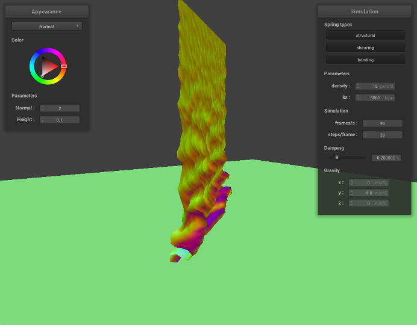 |       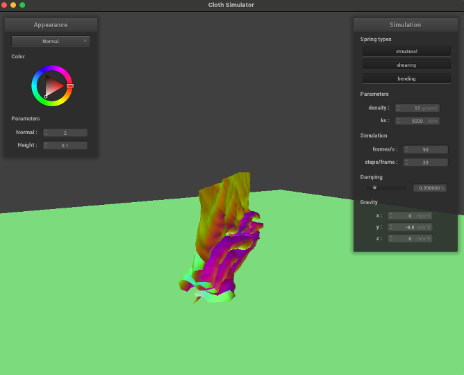       | 
|             Restful state             |              Entire Simulation (GIF)              |
| 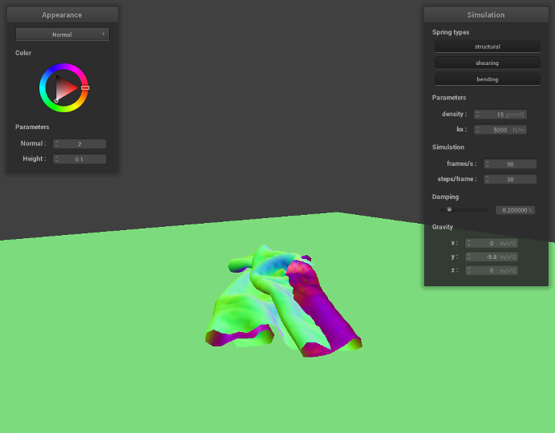 |  |

### How different `density` and `ks` affect the behavior
* First, we decrease the density to `1`, which indicates that the material become 15 times lighter.

|     Early, initial self-collision     |              Intermediate state               |
|:-------------------------------------:|:---------------------------------------------:|
| 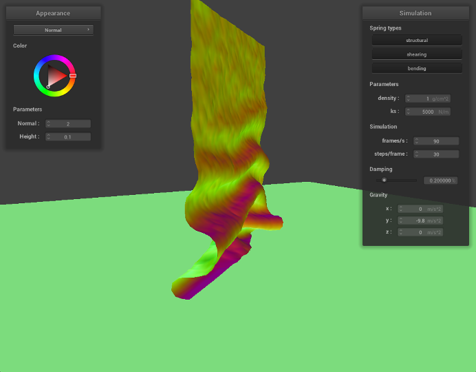 |     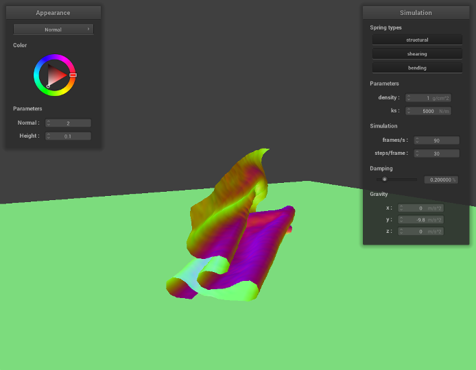     |
|             Restful state             |            Entire Simulation (GIF)            |
| 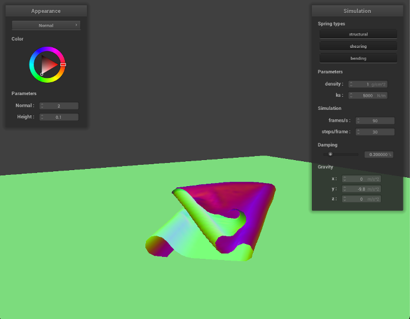 |  |

As we can see from the results, the falling cloth has much less folding and smother surfaces. Since the mass is much smaller, given the same `ks`, the local deformation become smaller, therefore, the cloth will have less stretching and results in a smother surface.

* Now, we increase the density to `100`, which indicates that the material become around 7 times denser or heavier.


|     Early, initial self-collision     |              Intermediate state               |
|:-------------------------------------:|:---------------------------------------------:|
| 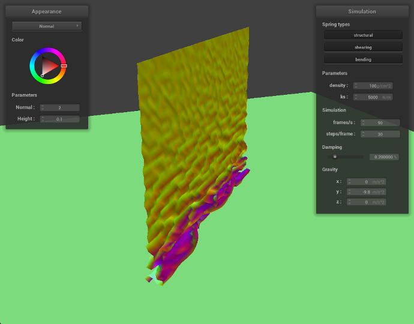 |     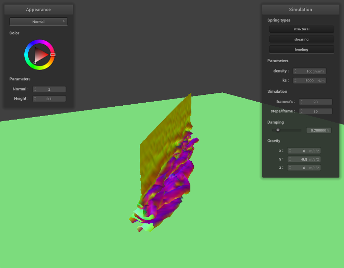     |
|             Restful state             |            Entire Simulation (GIF)            |
| 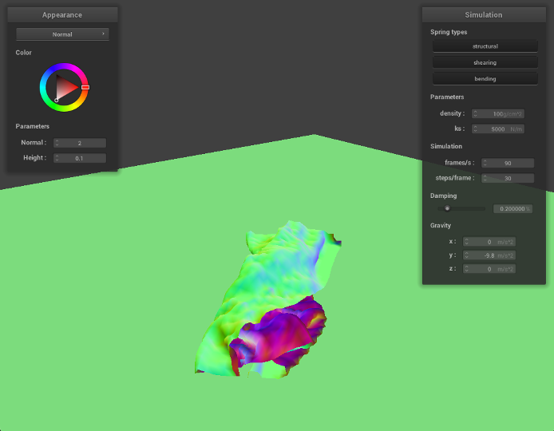 |  |

As we can see from the results, the falling cloth has much more folding and rougher surfaces. Since the cloth is much heavier, given the same `ks`, the local deformation become bigger, therefore, the cloth will have much more stretching and results in a rougher surface.
Due to the deformation, the cloth will have smaller surface area compared to the initial state.

* Now, we decrease `ks` to `50`, and set the density as `15`, with smaller `ks`, the springs will have larger deformations with the same force on it.


|     Early, initial self-collision     |              Intermediate state               |
|:-------------------------------------:|:---------------------------------------------:|
|  |          |
|             Restful state             |            Entire Simulation (GIF)            |
| 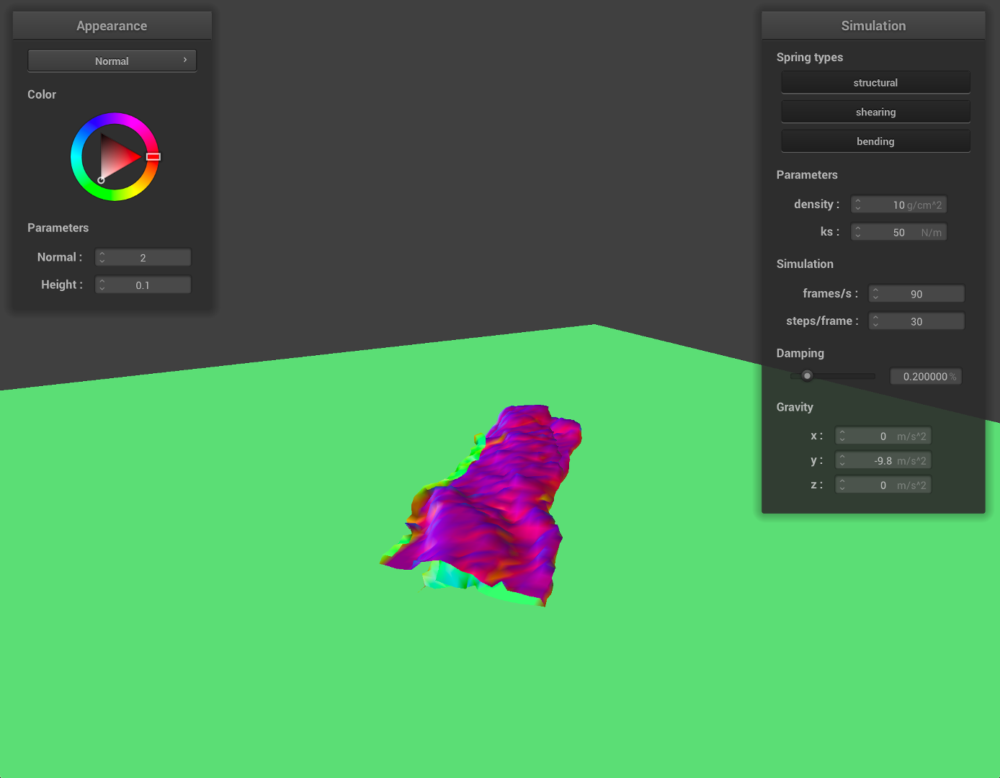 |  |

As we can see from the results, the falling cloth has much more folding and rougher surfaces, which is similar to the effect with higher density value. Since `ks` is smaller, given the same `density` value, the local deformation become bigger, therefore, the cloth will have much more stretching and results in a rougher surface.
Due to the deformation, the cloth will have smaller surface area compared to the initial state.

* Now, we increase `ks` to `20000`, and set the density as `15`, with larger `ks`, the springs will have less deformations with the same force on it.

|     Early, initial self-collision     |              Intermediate state               |
|:-------------------------------------:|:---------------------------------------------:|
| 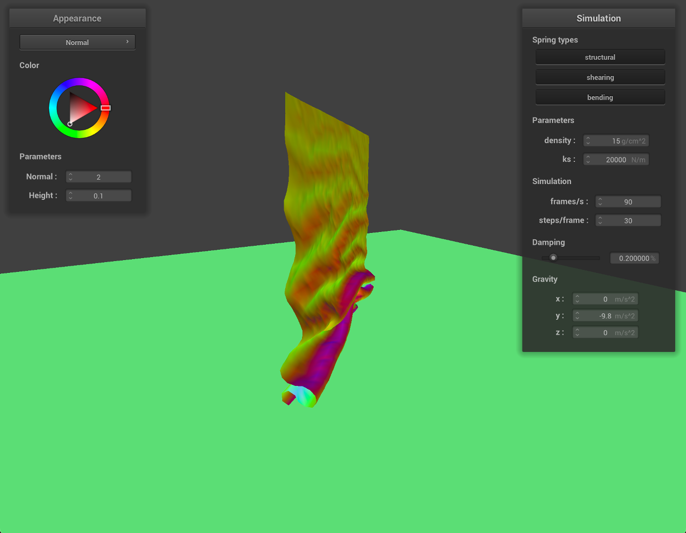 |          |
|             Restful state             |            Entire Simulation (GIF)            |
| 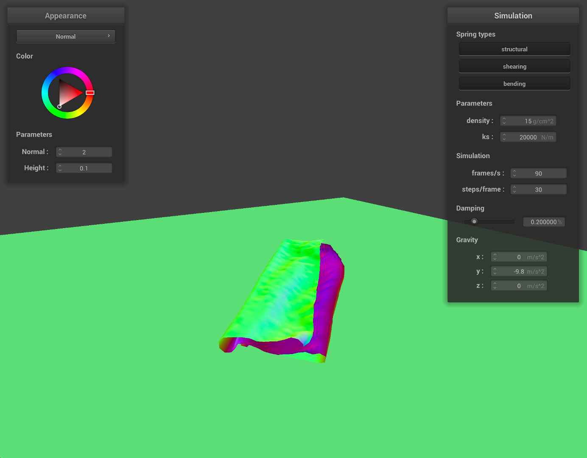 |  |

As we can see from the results, the falling cloth has much less folding and smother surfaces. Since `ks` has a much higher value, given the same `density`, the local deformation become smaller, therefore, the cloth will have less stretching and results in a smother surface.


## Part 5: Shaders

### Task 1: Diffuse Shading

Modified `Diffuse.frag`
```asm
void main() {
  // YOUR CODE HERE
  vec3 l= u_light_pos - v_position.xyz;
  float kd = 1;
  vec3 l_d = kd*(u_light_intensity)*max(0,dot(v_normal.xyz,normalize(l)))/dot(l,l);
  // (Placeholder code. You will want to replace it.)
  out_color = vec4(l_d,1);
}
```

GIF for the simulation
<p align="center">

</p>

### Task 2: Blinn-Phong Shading

Modified `Phong.frag`

```asm
void main() {
  // YOUR CODE HERE
  vec3 vnorm = normalize(v_normal.xyz);
  vec3 l= u_light_pos - v_position.xyz;
  vec3 v = u_cam_pos - v_position.xyz;

  vec3 h = normalize(normalize(l) + normalize(v));
  vec3 I_a = normalize(vec3(1,0,1));
  float k_a = 0.5;
  float k_d = 0.5;
  vec3 kd_term = k_d*(u_light_intensity/dot(l,l))*max(0,dot(vnorm,normalize(l)));
  float k_s = 0.5;
  float p = 20;
  vec3 ks_term = k_s*(u_light_intensity/dot(l,l))*pow(max(0,dot(vnorm,h)),p);
  // (Placeholder code. You will want to replace it.)
  vec3 L_total = k_a*I_a + kd_term + ks_term;
  out_color.rgb = L_total;
  out_color.a = 1;
}
```
GIF for the simulation
<p align="center">

</p>

We set `I_a` to be purple light.

### Task 3: Texture Mapping
Modified `Texture.frag`
```asm
void main() {
  // YOUR CODE HERE
  
  // (Placeholder code. You will want to replace it.)
  out_color = texture(u_texture_1,v_uv);
//  out_color.a = 1;
}
```

GIF for the simulation
<p align="center">

</p>

### Task 4: Displacement and Bump Mapping
#### 4.1: Bump Mapping
Modified `Bump.frag`
```asm
void main() {
  // YOUR CODE HERE

  vec3 v_norm = normalize(v_normal.xyz);
  vec3 v_tang = normalize(v_tangent.xyz);
  vec3 b = cross(v_norm,v_tang);
  mat3 TBN = mat3(v_tang,b,v_norm);
  float dU = (h(vec2(v_uv.x + 1/u_texture_2_size.x,v_uv.y))-h(v_uv))*u_height_scaling*u_normal_scaling;
  float dV = (h(vec2(v_uv.x,v_uv.y+ 1/u_texture_2_size.y))-h(v_uv))*u_height_scaling*u_normal_scaling;
  vec3 n0 = vec3(-dU,-dV, 1);
  vec3 nd = TBN * n0;

  vec3 vnorm = normalize(nd);
  vec3 l= u_light_pos - v_position.xyz;
  vec3 v = u_cam_pos - v_position.xyz;
  vec3 h = normalize(normalize(l) + normalize(v));
  vec3 I_a = normalize(vec3(1,0,1));
  float k_a = 0.5;
  float k_d = 0.5;
  vec3 kd_term = k_d*(u_light_intensity/dot(l,l))*max(0,dot(vnorm,normalize(l)));
  float k_s = 0.5;
  float p = 20;
  vec3 ks_term = k_s*(u_light_intensity/dot(l,l))*pow(max(0,dot(vnorm,h)),p);
  // (Placeholder code. You will want to replace it.)
  vec3 L_total = k_a*I_a + kd_term + ks_term;
  out_color.rgb = L_total;
  out_color.a = 1;
}
```

GIF for the simulation
<p align="center">

</p>

#### 4.2: Displacement Mapping
Modified `Displacement.vert`
```asm
float h(vec2 uv) {
  // You may want to use this helper function...
  return texture(u_texture_2,uv).r;
}

void main() {
  // YOUR CODE HERE

  // (Placeholder code. You will want to replace it.)
  v_position = u_model * (in_position+ in_normal*h(in_uv)*u_height_scaling);
  v_normal = normalize(u_model * in_normal);
  v_uv = in_uv;
  v_tangent = normalize(u_model * in_tangent);
  gl_Position = u_view_projection * u_model * (in_position+ in_normal*h(in_uv)*u_height_scaling);
}
```

GIF for the simulation
<p align="center">

</p>


### Task 5: Environment-mapped Reflections
Modified `Mirror.frag`
```asm
void main() {

  vec3 dir_cam = normalize(u_cam_pos - v_position.xyz);
  vec3 v_norm = normalize(v_normal.xyz);
  vec3 v_norm_scale = v_norm*dot(v_norm,dir_cam)*2;
  vec3 wi = normalize(v_norm_scale - dir_cam);
  out_color = texture(u_texture_cubemap,wi);
}
```

GIF for the simulation
<p align="center">

</p>

In this task, we created a new cube environment-mapping using our cat photos from 6 directions (definitely far from perfect):
<p align="center">

</p>


### Extra Credit: Environment-mapped Displacement Mapping

Now, we want to add our cat's textures to the displacement mapping! What we did is just sampling the light intensity term using the cube map: 

`vec3 intensity = texture(u_texture_cubemap,normalize(v)).rgb*4;`

Our `Custom.frag` file looks like:
```asm
void main() {
  vec3 v_norm = normalize(v_normal.xyz);
  vec3 v_tang = normalize(v_tangent.xyz);
  vec3 b = cross(v_norm,v_tang);
  mat3 TBN = mat3(v_tang,b,v_norm);
  float dU = (h(vec2(v_uv.x + 1/u_texture_2_size.x,v_uv.y))-h(v_uv))*u_height_scaling*u_normal_scaling;
  float dV = (h(vec2(v_uv.x,v_uv.y+ 1/u_texture_2_size.y))-h(v_uv))*u_height_scaling*u_normal_scaling;
  vec3 n0 = vec3(-dU,-dV, 1);
  vec3 nd = TBN * n0;

  vec3 vnorm = normalize(nd);
  vec3 l= u_light_pos - v_position.xyz;
  vec3 v = u_cam_pos - v_position.xyz;
  vec3 intensity = texture(u_texture_cubemap,normalize(v)).rgb*4;


  vec3 h = normalize(normalize(l) + normalize(v));
  vec3 I_a = normalize(vec3(1,1,1));
  float k_a = 0.3;
  float k_d = 1;
  vec3 kd_term = k_d*(intensity/dot(l,l))*max(0,dot(vnorm,normalize(l)));
  float k_s = 0.8;
  float p = 20;
  vec3 ks_term = k_s*(intensity/dot(l,l))*pow(max(0,dot(vnorm,h)),p);
  // (Placeholder code. You will want to replace it.)
  vec3 L_total = k_a*I_a + kd_term + ks_term;
  out_color.rgb = L_total;
  out_color.a = 1;
}
```

Gif Animation
GIF for the simulation
<p align="center">

</p>
